# Introduction

## Motivation

J'ai toujours eu recours à un pilote automatique. Les régulateurs mécaniques ont des limites et, en cherchant des solutions logicielles gratuites, j'ai trouvé uniquement des solutions limitées. C'est pour cette raison que pypilot a été créé pour offrir un pilote automatique auquel nous pouvons tous faire confiance et que nous pouvons étendre et modifier pour répondre à nos besoins.

## Philosophie de pypilot

Pypilot est un logiciel libre (GPLv3) et en tant que tel, vous pouvez lui faire confiance pour fonctionner comme prévu et pour une utilisation future sans restriction. Parce que la liberté de modification est garantie, les utilisateurs du monde entier ont continuellement contribué à des améliorations, même minimes, au bénéfice de tous les utilisateurs.

## Philosophie des calculateurs, contrôleurs et équipements de la boutique pypilot

Il est très instructif de faire fonctionner pypilot sur un gros raspberry pi avec OpenPlotter et d’autres applications, mais cela présente quelques inconvénients comme une consommation électrique élevée, l’obligation d’arrêter proprement les applications pour ne pas corrompre la carte SD du raspberry pi et le risque de dysfonctionnement du pilote automatique à la suite de mises à jour d’applications Openplotter (SignalK). En conséquence, il est préférable de faire fonctionner pypilot sur un petit calculateur raspberry pi zero, réservé exclusivement au pilote automatique, avec une version logicielle stable. Le pilote peut alors être arrêté simplement en coupant l’alimentation électrique.

Il est amusant et instructif d’assembler des composants pour faire fonctionner Pypilot. Mais très peu d’entre nous sauront le faire fonctionner avec des télécommandes radio avec une grande fiabilité. Sur un pilote automatique de bateau, il faut aussi ajouter des composants, inutiles sur un montage de coin de table, mais indispensables pour assurer un fonctionnement stable dans le temps en apportant la robustesse indispensable aux chocs électromagnétiques (CEM).

D’autres ne sauront pas installer l’application sur la carte SD ni modifier les fichiers linux de configuration pour indiquer les composants utilisés (IMU, afficheur, récepteur).

C’est pour toutes ces raisons que la boutique propose à un prix très raisonnable :

- Un calculateur étanche, déjà programmé, livré avec une alimentation 12/24V et une télécommande radio. Ce calculateur peut être commandé par une ou plusieurs des cinq interfaces de contrôle décrites dans [logiciels et utilisation](#logiciels-et-utilisation).
- Trois contrôleurs de différentes puissances (7, 15 et 30A) permettant d’adapter pypilot à tous les actionneurs existants, y compris 24V pour les versions 15 et 30A. Ils permettent la connexion d’éventuels capteurs d’angle de barre, de fins de course et de température.

Il suffit de simplement les connecter entre eux pour constituer un pilote automatique moderne, performant, économique, robuste et sûr. Il est aussi possible d’ajouter plusieurs télécommandes et claviers radio déportés étanches et même d’autres calculateurs comme unité de commande ou afficheur. Voir [Remote Mode](#remote-mode-pour-commande-avec-des-calculateurs-supplementaires). Un adaptateur NMEA0183, disponible en boutique, ou un réseau wifi, permet de fournir au calculateur les données de capteurs (speedo,  girouette, GPS) utiles pour certains [modes](#modes-de-tenue-du-cap).

## Limitations de cette documentation

Ce manuel d'utilisation suppose l'utilisation d'un Raspberry pi zéro exécutant exclusivement pypilot à l'aide du système tinypilot, à l’identique du calculateur pypilot de la boutique. Si vous exécutez pypilot sous Openplotter ou un autre système d'exploitation, sachez qu'une partie de cette documentation concerne uniquement la configuration tynipilot.

# Matériel et installation

## Instructions de montage

### Emplacement du calculateur du pilote automatique

Trouvez un bon emplacement sur le bateau pour monter le calculateur du pilote. Même si la dernière version du calculateur de la boutique est dans un boitier étanche avec presse-étoupes, il est toujours judicieux de monter celui-ci à l'intérieur du bateau pour le protéger de l’ambiance marine. Si vous devez installer le calculateur à l'extérieur, envisagez une protection supplémentaire (coffret étanche transparent) ou utilisez une clavier radio.

Le calculateur du pilote automatique a un capteur IMU à 9 degrés de liberté avec des accéléromètres, des gyromètres et des capteurs magnétiques dans chacun des trois axes x, y et z. Voici les recommandations générales d’installation pour chacun des types de capteur de l’IMU :

- Accéléromètres : montez le calculateur près du centre du bateau car la proue et la poupe subissent les plus grandes accélérations 
- Gyromètres : évitez d’installer le calculateur à proximité de vibrations potentielles
- Magnétomètres :
    - Evitez le métal ferromagnétique. Sur un bateau en acier, ne montez pas le calculateur contre la coque ou une cloison métallique, mais à au moins 100 à 200mm.
    - Evitez les aimants, en particulier les aimants mobiles et les haut-parleurs.
    - Evitez les fils conducteurs de courant, en particulier ceux dans lesquels le courant fluctue (énergie solaire, moteur du pilote, etc.). Une règle simple est de s'éloigner de 2cm pour chaque ampère traversant le fil. Torsadez les fils d'alimentation passant près du calculateur pour réduire les interférences magnétiques générées par le courant.
    - Evitez de monter à un endroit proche d'objets souvent déplacés et replacés (tiroirs d'outils, etc...). Certains inox peuvent être magnétiques. Le déplacement d'objets métalliques trop près des capteurs en route peut provoquer des manœuvres inattendues, notamment des empannages incontrôlés.

Le plus gros problème lors du montage est l'interférence magnétique. L'effet est lié au cube de la distance, la proximité est donc le plus gros problème. L'effet peut être tout simplement testé en comparant les relevés du cap affiché tout en appliquant intentionnellement des interférences via des fils ou d'autres moyens pour avoir une idée de la sensibilité. En général, l'effet n'est problématique que lorsque les objets sont placés à quelques centimètres du capteur IMU du calculateur.

### Emplacement du contrôleur moteur

Pour limiter les perturbations du compas magnétique du pypilot, il ne faut pas installer le contrôleur du moteur, ses fils d’alimentation et ceux du moteur contre le calculateur du pilote.

Le câble de données entre le calculateur et le contrôleur, robuste vis-à-vis des perturbations électromagnétiques peut atteindre une longueur de 30 mètres. 

Si on connecte des capteurs optionnels au contrôleur du moteur (fins de course, capteur d’angle de température moteur), il est judicieux d’installer le contrôleur à proximité du moteur pour privilégier des câbles courts entre ces capteurs et le contrôleur. C’est favorable vis-à-vis des perturbations électromagnétiques. En installant le contrôleur ainsi, la mesure de la tension d’alimentation du moteur par le contrôleur sera aussi plus représentative.

Si le calculateur pypilot consomme très peu, le câble d’alimentation du contrôleur et celui du moteur doivent être dimensionnés pour que leur résistance électrique totale ne soit pas beaucoup plus importante que la résistance interne du contrôleur utilisé. Voir [alimentation](#alimentation-electrique-du-controleur-du-moteur)

### Emplacement du clavier radio avec la touche menu

Ce clavier radio permet de contrôler directement pypilot avec l’afficheur LCD du calculateur. L’emplacement du clavier doit donc vous permettre de lire l’afficheur du calculateur. Il faut aussi que son câble d’alimentation électrique 12/24V puisse être raccordé à l’alimentation 12/24V du convertisseur 5V DC du pypilot. Une ou plusieurs télécommandes radio peuvent être utilisées en plus et d’autres claviers peuvent aussi être installés ailleurs dans le bateau.

## Vue d'ensemble des connexions électriques

### Câble de données du contrôleur moteur

Le contrôleur de moteur communique avec le calculateur pypilot par un câble de données série à 4 conducteurs équipé d’un connecteur étanche. Cette liaison est très robuste vis-à-vis des perturbations électromagnétiques et des chocs électriques car le contrôleur du moteur est équipé d’une isolation galvanique par optocoupleur. De plus, des diodes TVS protègent le calculateur et le contrôleur vis-à-vis des chocs électriques sur ce câble.

La vitesse de transmission de 38400 bauds est suffisamment faible pour que ce câble puisse être prolongé d'au moins 30 mètres avec du câble téléphonique ou du câble Ethernet. Si vous êtes particulièrement préoccupé par les interférences, vous pourriez utiliser un câble blindé, mais c'est rarement, voire jamais, une préoccupation dans la pratique.

Les connecteurs des différents produits pypilot sont interconnectables et interchangeables, mais comme l'usine a modifié  les couleurs des fils, la fonction doit être déterminée à partir du tableau suivant. Chaque câble est de type 1, 2 ou 3, selon la couleur des fils présents.

| Fonction | type 1 | type 2 | type 3 | broche raspberry |
| -------- | ------ | ------ | ------ | ------------- |
| +3.3v    | Rouge  | Marron | Noir   | 1             |
| tx	   | Vert   | Blanc  | Marron | 8             |
| rx	   | Bleu   | Bleu   | Vert   | 10            |
| 0v, GND  | Noir   | Noir   | Bleu   | 6, 9          |

La puissance 3v3 n'est utilisée que pour alimenter le photo coupleur d’isolation galvanique du contrôleur du moteur. Il ne conduit que quelques milliampères.

Si le câble doit être prolongé, il est recommandé de souder les fils et de les protéger par des manchons thermo rétractables. Si le raccordement est réalisé dans un endroit protégé et sec, l’utilisation de bornes Wago est envisageable.

### Alimentation électrique du calculateur et des claviers radio

Le calculateur pypilot s’alimente à partir du 12 ou 24V du bateau via un convertisseur DC-DC 5V standard, équipé en sortie d’un câble USB-C 5V qui doit être connecté au cordon USB-C femelle d’alimentation du calculateur. La consommation électrique typique du calculateur, équipé d’un Raspberry pi Zero, est de 0,07 ampère en 12V, soit 840 mW. Le calculateur pypilot intègre un circuit de protection pour éviter les surtensions, les inversions de tension et les courts-circuits. Pour éviter d’interférer avec les capteurs magnétiques du calculateur pypilot, le convertisseur 5V doit être installé aussi loin que le permettent les cordons USB-C.

Les claviers radio (sauf le modèle alimenté par piles) ont besoin d'une alimentation électrique 12/24 volts pour fonctionner. Il suffit de simplement les raccorder à la même alimentation 12/24V que le convertisseur 5V USB-C d’alimentation du calculateur pypilot ou au câble d’alimentation 12/24V du contrôleur.

### Alimentation électrique du contrôleur du moteur

Le contrôleur du moteur a besoin d'une alimentation électrique avec des câbles dimensionnés en fonction du courant consommé par le moteur. Le contrôleur de moteur 7A ne peut fonctionner qu'en 12 volts (plage de 9 à 16 volts) tandis que les contrôleurs de moteur de puissance moyenne et élevée peuvent fonctionner avec des moteurs 12 ou 24V. Le tableau suivant suggère des sections de câbles permettant d’avoir une résistance électrique de câble ne dépassant pas trop la résistance interne du contrôleur utilisé.

| Contrôleur                   | câble de 3m | câble de 4m | câble de 6m | 
| ---------------------------- | ----------- | ----------- | ----------- |
| Contrôleur pypilot 7A             | 2 x 2mm² | 2 x 3mm² | 2 x 5mm² |
| Contrôleur intermédiaire  15A     | 2 x 3mm² | 2 x 5mm² | 2 x 7mm² |
| Contrôleur de forte puissance 30A | 2 x 5mm² | 2 x 7mm² | 2 x 10mm²|

### Données USB

Un port USB est disponible pour une utilisation optionnelle. Il permet d’y connecter un GPS USB ou un autre capteur tel qu’une girouette. La boutique propose un convertisseur USB vers NMEA avec isolation galvanique pour s'interfacer avec les capteurs NMEA0183 ou le pypilot_mfd. Il est également courant de ne pas utiliser le port USB ou de l'envisager pour une utilisation future.

### Sortie d'embrayage (clutch)

Certains actionneurs de barre, en particulier les plus puissants, utilisent un embrayage commandé électriquement. C’est souvent une électrovanne avec les systèmes hydrauliques ou un embrayage mécanique commandé par un solénoïde pour les autres actionneurs. Les contrôleurs de moteur de puissance moyenne et élevée ont tous deux une borne de sortie CLUTCH (à l’extrême gauche). Celle-ci fournit une polarité négative (-) lorsque le pilote est activé ou commandé manuellement pour se déplacer. Le fil (+) de l’embrayage est à raccorder à la borne d’alimentation + du contrôleur qui se trouve juste à côté de la sortie d'embrayage.

En règle générale, l'embrayage délivre une puissance maximale pendant 200 à 300 ms, puis se réduit à un signal PWM (haché) pour maintenir l'embrayage en marche tout en minimisant la consommation d'énergie. La valeur de la puissance de sortie de l'embrayage peut être configurée avec le paramètre "servo.clutch_pwm" (plage de 0 à 100%).

Le fait que pypilot contrôle la sortie CLUTCH négative (-) permet d’utiliser un actionneur électrique à moteur 24V et embrayage 12V. Il suffit alors de connecter le fil + de l’embrayage au +12V de l’alimentation électrique au lieu de le connecter à la borne + d’alimentation du contrôleur de moteur en 24V.

### Capteur d'angle de barre

Tout d'abord, le capteur d’angle de barre est facultatif. Il peut être déconnecté en cours de route et pypilot continuera à piloter. Il est généralement utilisé pour signaler l'angle du gouvernail sur un indicateur ou pour arrêter le moteur en fin de course. Il peut également être utilisé par certains algorithmes de pilotage pour améliorer la direction, mais l'algorithme de pilotage « basic » ne l'exige pas. Pour être clair, les corrections nécessaires dans des conditions modérées sont au minimum 10 fois supérieures aux erreurs consécutives à la non connaissance de la position de la barre. L'amélioration potentielle des performances de pilotage grâce au capteur d’angle de barre n'est pas énorme. Il faut aussi toujours se rappeler qu’utiliser le capteur d’angle de barre pour limiter la course de l’actionneur risque de neutraliser le pilote automatique si la tige de liaison à la mèche est malencontreusement tordue ou déconnectée. Des contacts de fins de course bien installés ou un bon réglage de la limitation d’intensité seront souvent plus sûrs pour limiter les efforts sur le système de barre.

Le capteur d’angle de barre doit être électriquement raccordé au contrôleur de l’actionneur. En effet, il produit une tension analogique (mesure) avec l'angle du gouvernail. Si vous disposez déjà d'un capteur de barre existant, vous pouvez le réutiliser en toute sécurité, mais sachez que la plage de résistance électrique acceptable est de 1 KΩ à 100 kΩ. Le capteur de barre de la boutique pypilot est entièrement étanche et utilise non pas un potentiomètre, mais un aimant et un capteur angulaire à effet Hall pour fournir une tension variant avec l'angle, évitant ainsi les problèmes d'usure des potentiomètres.

En ce qui concerne le câble avec connecteur étanche, comme pour le contrôleur moteur, il existe différentes combinaisons de codages de fils possibles en fonction des couleurs de fils présentes :

| Fonction | type 1 | type 2 | type 3 |
| -------  | -----  | ------ | ------ |
| +5v      | Red    | Brown  | Red    |
| Mesure   | Yellow | Blue   | Black  |
| 0v, GND  | Black  | Yellow | Blue   |

La connexion sur le circuit imprimé du contrôleur du moteur est repérée "Rudder". Le contact carré est GND, le central est celui de la mesure et la dernière broche est l’alimentation 5V.

Il n'est pas essentiel que la tension augmente ou diminue dans un sens donné de rotation de la barre, car l'étalonnage du retour d'information du gouvernail prend en charge la direction.

### Contacts de fin de course

Les contacts de fin de course sont optionnels mais peuvent être utiles pour réduire les forces appliquées au système de gouvernail si le capteur d'angle de barre se dérègle (tige pliée ou déconnectée). Lorsque l'un d'eux se ferme, le contrôleur empêche tout mouvement supplémentaire du moteur dans cette direction. Fermé signifie que le fil de l'interrupteur est court-circuité à GND. 

Les broches sont étiquetées « End Stops » sur le contrôleur de moteur et la broche GND est carrée. Certains contrôleurs de moteur fournissent également du +5V pour permettre l’alimentation d’un capteur à 3 fils dont la sortie est court-circuitée à GND quand passe à proximité du métal (détecteur de proximité) ou un aimant (capteur à effet Hall).

Dans tous les cas, il faut toujours veiller à ce que les capteurs de fins de course restent électriquement fermés lorsque le safran est complètement en butée, au-delà de l’angle où on les règle pour arrêter le moteur de l’actionneur.

### Capteur de température

Les contrôleurs de moteur pypilot incluent tous un capteur de température intégré, mais il est également possible de surveiller la température du moteur ou de la pompe. Pour ce faire, connectez un capteur NTC 10k aux broches étiquetées « Motor Temp ». La limite de température peut être configurée pour protéger le variateur contre la surchauffe, mais en pratique, le moteur ne devrait jamais s'approcher du réglage typique de 60 °C. Voir [boutique](https://pypilot.org/opencart/index.php?route=product/product&path=60&product_id=65).

## Entretien

Au fil du temps, les contacts électriques peuvent se desserrer en raison des changements de température saisonniers. Les bornes choisies pour le contrôleur de moteur minimisent le problème, mais il est judicieux de les vérifier et de s'assurer que les bornes sont bien serrées après un hiver ou une période plus longue. 

Les actionneurs linéaires utilisés pour déplacer le gouvernail doivent être stockés à l'abri des intempéries lorsqu'ils ne sont pas utilisés pour prolonger leur durée de vie. Évitez de les stocker dans des zones du bateau qui peuvent devenir très chaudes et humides, comme des compartiments entièrement fermés, car cela peut augmenter considérablement la corrosion. Il est préférable de les stocker à l’intérieur et de maintenir le bateau ventilé, de même pour l'électronique.

Pour le clavier radio à piles, il est recommandé d’enlever les piles si le bateau doit rester très longtemps inutilisé.

## Installation mécanique

### Types d'actionneurs suggérés

Pour plus d'information sur les [actionneurs](http://pypilot.org/actuators/)

#### Bateau à barre franche

Il est recommandé d'utiliser un actionneur linéaire de base. Il s'agit d'une solution simple et facile à monter et à démonter. En général, une rotule de 6mm est montée sur la barre, soit en perçant un trou dans la barre elle-même, soit en utilisant un petit bloc de bois fixé par un collier de serrage ou par des attaches à la barre. La rotule permet une légère rotation dans les deux axes lors de son déplacement vers l'intérieur et vers l'extérieur. L'actionneur linéaire doit également être fixé au bateau de façon à permettre une légère rotation dans les deux axes lors de son déplacement. Cela est nécessaire pour minimiser le « jeu » dans le système, ce qui réduira le temps de réaction et l'efficacité.

L'actionneur linéaire lui-même peut être un actionneur de barre franche existant ou un actionneur linéaire. La vitesse, la force et la portée varient d'un bateau à l'autre. En général, un entraînement rapide est préférable car il peut corriger plus tôt et maintenir une trajectoire plus droite, ce qui signifie moins de mouvement global et de consommation d'énergie. La force requise dépend vraiment du navire, les gouvernails non compensés avec une surface importante nécessitant beaucoup plus de force que les gouvernails compensés avec des voiles équilibrées. Avec un safran non compensé, il peut être judicieux d’installer deux goupilles sur la barre, une plus proche de l’axe du safran pour favoriser la vitesse au portant et la deuxième plus éloignée pour favoriser la force au près.

#### Bateau avec barre à roue

Pour les bateaux à barre à roue, il est possible d'entraîner directement la roue à l'aide d'un système de transmission. Un exemple serait une poulie dentée imprimée en 3D boulonnée aux rayons de la roue entraînée par un moteur d'essuie-glace. Le plus difficile à réaliser est le moyen d'engager ou désengager efficacement le moteur pour être certain de pouvoir facilement reprendre rapidement la barre. Il faut bien veiller à l'alignement de la poulie sur la roue. Un léger désalignement peut entraîner une modification de la tension de la poulie ainsi que le saut de dents pendant la rotation.

Les rapports de démultiplication généralement utilisés sont compris entre 4:1 et 8:1. Un moteur d'essuie-glace effectue généralement 1 rotation par seconde, ou 1,5 en mode haute vitesse.

Une autre option est un moteur de direction assistée de voiture électrique. Ces moteurs sont plusieurs fois plus puissants qu'un moteur d'essuie-glace, très durables et efficaces

#### Direction hydraulique

Il existe de nombreux schémas hydrauliques différents pour les bateaux selon qu'il y a une ou plusieurs barres à roue. Globalement, tous les systèmes hydrauliques peuvent être utilisés avec pypilot si une pompe hydraulique électrique est utilisée pour déplacer le gouvernail. Si vous n'êtes pas sûr de la taille de la pompe, la plus grande est recommandée à la fois pour la longévité (moins de chaleur) et la vitesse de barre. Une pompe plus puissante permet d’économiser de l'énergie en permettant des corrections plus rapides.

### Vitesse de déplacement de la barre

La vitesse à laquelle le moteur peut déplacer le safran est l'un des éléments les plus importants à prendre en compte pour une bonne expérience de pilotage automatique. Les exigences réelles varient considérablement en fonction des conditions, de l'allure, du type de gouvernail, du bateau et d'autres facteurs.

Au fur et à mesure qu'un bateau va vite, le gouvernail devient plus efficace, donc même s'il nécessite des corrections plus rapides, parce que le gouvernail est plus efficace, les deux facteurs s'annulent généralement et le même réglage fonctionne bien sur une large plage de vitesses du bateau. À très basse vitesse (conditions de dérive), les corrections peuvent être beaucoup plus lentes, mais cela a généralement plus à voir avec des corrections moins dynamiques nécessaires (moins de vagues ou de rafales de vent).

En règle générale, visez à obtenir un temps de déplacement du gouvernail de ± 30 degrés ne dépassant pas plus de 6 à 8 secondes. De nombreux bateaux ont installé des systèmes plus lents et il est acceptable de les utiliser, mais les performances du pilote automatique sont directement liées à la vitesse à laquelle le pilote peut déplacer le gouvernail. Les plus gros bateaux n'ont pas besoin de déplacer le gouvernail aussi vite que les plus petits. Les vents légers ou la navigation au près ne nécessitent pas de déplacer le gouvernail aussi vite que les vents forts ou la navigation au portant. Le mauvais temps ou la navigation au près contre le courant exigent une plus grande vitesse.

J'ai installé un actionneur sur mon trimaran de 33 pieds qui peut déplacer le gouvernail de 15 à 20 degrés par seconde et je peux dire que je suis assez satisfait des performances. Un mouvement de 10 degrés/s serait également acceptable, mais je ne souhaiterais rien de plus lent, sauf par vent léger.

Sur un gouvernail sur la quille ou l'étambot, non compensé, la vitesse de mouvement du gouvernail requise pour naviguer au portant est beaucoup plus élevée que pour naviguer au près, mais la force nécessaire au près avec la barre est bien supérieure à celle nécessaire pour naviguer au portant. Dans ce scénario, il peut être avantageux d'avoir 2 goupilles sur la barre à différentes distances de l’axe du safran. On utilise la plus proche de l’axe pour favoriser la vitesse au portant et la plus lointaine pour un plus grand couple au près. De même, dans un système hydraulique, il peut être envisagé d'avoir deux pompes et de les utiliser toutes les deux par mauvais temps.

En pratique, peu de bateaux prennent de telles mesures, mais cela pourrait valoir la peine d'être exploré. Avec un gouvernail équilibré, la situation est beaucoup plus simple car la force requise est généralement très faible. En général, le système d'entraînement doit être dimensionné pour les conditions les plus difficiles, et le pypilot peut toujours être réglé pour déplacer le moteur plus lentement par vent faible.

### Embrayage/désengagement d'urgence

Il est essentiel de s'assurer que vous pouvez rapidement reprendre le contrôle manuel si nécessaire. Les systèmes avec un actionneur toujours connecté à la mèche de safran, tels que les gros actionneurs électriques et les systèmes hydrauliques ont souvent une sortie d'embrayage. Il est alors judicieux d’installer près de la barre une télécommande ou un clavier radio permettant de désengager le pilote ou à minima un interrupteur permettant de désexciter l’embrayage pour pouvoir reprendre le contrôle manuel de la barre. Pour les autres systèmes qui s'engagent manuellement, comme les pilotes de barre, il est généralement facile de soulever l'actionneur de la goupille, mais un système à entraînement par roue doit être soigneusement conçu pour garantir que le contrôle manuel est toujours facile à reprendre.

### Plage de rotation de la barre

En général, un mouvement de ± 30 degrés est souhaité pour virer de bord, mais seulement ± 15-20 degrés sont nécessaires pour maintenir un cap. À un certain angle, la plupart des gouvernails « décrochent » à une vitesse spécifique et deviennent de toute façon moins efficaces. Des angles de gouvernail plus élevés sont utilisés à très basse vitesse, lors de l'accostage ou pour agir comme un frein. Ils ne sont généralement pas utiles pour le pilote automatique.

## Télécommandes et claviers radio

Les calculateurs pypilot de la boutique sont équipés d’un récepteur 433 MHz et d’un processeur ATmega328P (Arduino) spécialement dédié à la gestion des télécommandes. Plusieurs télécommandes ou claviers radio 433 MHz peuvent être utilisés pour contrôler le pilote avec une communication fiable et une faible latence. L’utilisation de la fréquence 433 MHz permet d’éviter des interférences avec le wifi et le Bluetooth. Le calculateur est équipé d’une antenne filaire 433MHz de 173 mm qu’il faut, autant que possible, essayer de laisser dégagée. Pypilot permet de facilement associer n’importe quelle touche d’une télécommande à n’importe quelle fonction. Voir [configuration](#programmation-des-telecommandes-et-claviers-radio).

La boutique pypilot propose des claviers radio, spécialement conçus pour le calculateur pypilot, avec d’importantes améliorations par rapport aux télécommandes de portes de garage. Un de ces modèles fonctionne même sur pile durant plusieurs années. Tous sont étanches ou complètement enrobés. Ils disposent de boutons -10 -1 +1 +10. Ils envoient des codes alternés et les appuis rapides successifs sur les touches sont enregistrés dans un tampon afin de ne perdre aucun ordre. Ils prennent en charge l'appui simultané de plusieurs touches (par exemple : virement de bord en appuyant sur +10 et +1). Ils permettent également de changer de canal pour éviter d'interférer avec les bateaux à proximité du pypilot (en maintenant les boutons +10 et -10 et en sélectionnant un autre canal). 

Les télécommandes peuvent être configurées à l'aide d'un navigateur Web, voir [configuration](#programmation-des-telecommandes-et-claviers-radio).

### Télécommande radio 433 MHz du type porte de garage

Toutes les télécommandes radio 433 MHz à code EV1527, dites à code tournant, couramment utilisés pour les portes de garage, peuvent être utilisées avec le calculateur pypilot. Quelques-unes sont étanches. On les trouve moins cher sur internet que le prix de la pile de rechange. L’utilisation d’une protection 3D facilite leur utilisation sans erreurs et améliore également leur flottabilité si un faible taux de remplissage est utilisé. .

#### Clavier radio à 7 touches alimenté en 12-24V

Ce [clavier radio](https://pypilot.org/opencart/index.php?route=product/product&path=63&product_id=61) est équipé des touches Menu et Mode. La touche Menu permet d'accéder à l'interface du menu LCD du calculateur. La touche Mode permet de passer au mode disponible suivant. Ce clavier est donc destiné à être monté à proximité de l'écran LCD du calculateur pypilot. Il doit être alimenté entre 9 et 40 volts et dispose des touches standard  -10 -1 +1 +10. La touche Auto permet d'activer ou de désactiver le pilote automatique. Il est possible de reprogrammer les touches (par exemple : Auto pour activer et Menu pour désactiver) mais les autres claviers radio disponibles en boutique sont plus adapté au pilotage de pypilot lorsque l'écran n'est pas visible.

#### Clavier radio à 8 touches alimenté en 12-24V

Ce [clavier radio](https://pypilot.org/opencart/index.php?route=product/product&path=63&product_id=64) s’alimente aussi entre 9 et 40 volts et fournit les touches standard -10 -1 +1 +10. Plutôt que d'engager/désengager le pilote, il dispose d’une touche permettant de toujours désengager le pilote. Les boutons C, G, W activent le pilote dans les modes Compas, GPS et Vent. Appuyer simultanément sur C et G permet d'accéder au mode Nav, et sur G et W en même temps pour accéder au mode Vent réel.

#### Clavier radio à 8 touches fonctionnant sur piles

Ce [clavier radio](https://pypilot.org/opencart/index.php?route=product/product&path=63&product_id=62) a des fonctions identiques au précédent à 8 boutons, mais il est alimenté électriquement avec 2 piles AA pour simplifier son installation. Le courant de veille est de 4 à 6 µA, donc les piles devraient généralement durer plusieurs années. Il est cependant recommandé de n'utiliser que des piles alcalines et de les remplacer tous les deux ans pour éviter qu’elles se mettent à couler.

# Logiciels et utilisation

Ce manuel suppose l'utilisation d'un Raspberry pi zéro exécutant exclusivement pypilot à l'aide du système tinypilot. Si vous exécutez pypilot sous openplotter ou un autre système d'exploitation, sachez qu'une partie de cette documentation concerne uniquement la configuration tynipilot comme celles des calculateurs de la boutique

## Préalables obligatoires avant de piloter le bateau avec pypilot

Avant d’engager pypilot pour piloter automatiquement son bateau, il faut d’abord réaliser au minimum les opérations suivantes dans l’ordre indiqué :

- Etalonnage des accéléromètres, c’est déjà fait sur les calculateurs provenant de la boutique. Un nouvel étalonnage est recommandé après chaque changement d’image de la carte SD. Calculateur démonté, l’étalonnage des accéléromètres du calculateur se fait de préférence à terre, sur une surface horizontale comme une table. Voir [étalonnage accéléromètres](#etalonnage-des-accelerometres).
- Après installation du calculateur sur le bateau et avec le bateau bien horizontal et stable, il faut indiquer au calculateur que le bateau est de niveau. Voir [initialisation capteurs inertiels](#initialisation-des-capteurs-inertiels-avec-le-bateau-de-niveau).
- Vérification du sens de rotation du moteur (inverser les deux fils du moteur si nécessaire).
- Etalonnage du compas magnétique en faisant tourner le bateau en mer. Voir [étalonnage compas](#etalonnage-du-compas-magnetique)
- Alignement du compas de pypilot avec le compas magnétique en introduisant si nécessaire un décalage.
- Vérification qu’aucun objet magnétique mobile du bord ne perturbe le compas du calculateur

En plus, si on a pas installé de fins de course du moteur (contacts ou détecteur de proximité), il faut aussi mettre en service une autre méthode de limitation de la course du moteur  :

- Avec un pilote de barre : il faut ajuster la limitation d’intensité du moteur avec le paramètre servo.max_current pour que le moteur ne force pas anormalement en fin de course. Voir [servo.max_current](#parametres-du-controleur-moteur).
- Avec un capteur d’angle de barre : il faut étalonner celui-ci et le régler pour que le drive ne force pas sur le gouvernail. Voir [étalonnage capteur d'angle de barre](#etalonnage-du-capteur-de-barre)

## Mise sous tension et arrêt

### Ecran de démarrage

L'écran d'accueil s' affiche 10 à 15 secondes après la mise sous tension. Il indique la version du pypilot et peut être utile pour le débogage du système.

### Ecran du calculateur

Le calculateur pypilot dispose d'un module LCD du type COG, visible à la lumière du jour et rétroéclairé la nuit. Ce LCD affiche du haut versle bas :

- Le cap du bateau
- Standby ou la consigne si pilote engagé ou un éventuel message d'erreur
- le [mode](#modes-de-tenue-du-cap) utilisé est indiqué dans un cadre, ici C pour compas
- une lettre P majuscule suivie des 2 premières lettres du nom du [profil](#profils) de réglages utilisé, ici "de" pour "default"
- en bas à droite, un point clignote quand le programme communique avec le pypilot du pilote automatique.

### LED sur le contrôleur moteur

Lorsque l'alimentation est appliquée au contrôleur de moteur, une LED rouge doit s'allumer pour indiquer l'alimentation. Il y a une LED verte et jaune qui indiquent que les données sont reçues et transmises et qui clignotent généralement chaque fois qu'il communique avec le calculateur du pilote automatique. Enfin, une LED blanche ou bleue indique que le contrôleur est engagé et commande le moteur. Si seule la rouge apparaît, il y a un problème de communication. Si la jaune ou verte reste allumé en permanence, il y a probablement une connexion en court-circuit

### Mise hors tension
Les calculateurs pypilot de la boutique sont équipés d’un pi zéro. Ils exécutent une distribution spéciale de Linux appelée tinypilot, basée sur  linux. Après le démarrage, le système fonctionne généralement sans écrire sur la carte SD. Pour cette raison, l'alimentation du calculateur du pilote automatique peut être coupée à tout moment sans trop de risques. Il est possible d'exécuter tinypilot sur différents modèles de Raspberry pi, mais il n'y a pas beaucoup de raison d'utiliser un Pi plus gros car tinypilot est dédié à l'exécution de pypilot exclusivement et la puissance de calcul est suffisante.

Pour les systèmes exécutant openplotter ou d'autres distributions, il peut être conseillé de s'arrêter de manière contrôlée, le système ne démarrera généralement pas si la partition de démarrage est corrompue, ce qui n'est généralement pas monté, c'est donc rarement un problème même dans ce cas de perte de puissance, mais il est possible d'avoir un commutateur qui arrête proprement le raspberry. Pour une fiabilité ultime, vous pouvez garder une carte SD de rechange prête à démarrer

## Interface de contrôle du pilote avec le menu LCD

### Entrée dans le menu LCD

Pour entrer dans le menu LCD, il faut des touches raccordées au GPIO, une télécommande infrarouge ou une télécommande (ou clavier radio) avec 7 touches dont les touches Menu et Mode.

Les fonctions des 7 touches diffèrent selon le mode comme indiqué ci-dessous :

| Touche | Fonction avec pilote activé     | Fonction avec pilote désactivé    | Fonction dans le menu  |
| --- | --- | ---- | ---- |
| -10 | Change consigne de -10° | Déplacement rapide barre* | Déplacement Haut/Gauche rapide |
|  -1 | Change consigne de -1°  | Déplacement lent  barre* | Déplacement Haut/Gauche      |
|  +1 | Change consigne de +1°  | Déplacement lent barre* | Déplacement Bas/droite   |
| +10 | Change consigne de +10° | Déplacement rapide barre* | Déplacement Bas/droite rapide |
| Auto | désactive le pilote | active le pilote | Sortie du Menu |
| Menu | Entrée Menu | Entrée Menu | Sélection, entrée sous-menu |
| Mode | Mode suivant | Mode suivant | Retour vers le précédent menu |

* Le déplacement de la barre se fait tant que la touche est maintenue enfoncée et s'arrête lorsqu'elle est relâchée.

Une autre fonction est le virement qui peut être déclenché en appuyant simultanément -10 et -1 pour virer sur bâbord, +1 et +10 simultanément pour virer sur tribord

Le menu principal ci-contre offre plusieurs fonctions pour configurer pypilot.

### Gains

  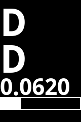

Le menu gain permet de modifier le profil ainsi que les gains. Lorsqu'un nouveau profil est sélectionné, tous les gains sont mis à jour.

### Etalonnage

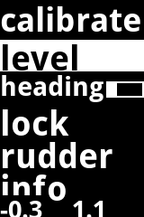

Le menu d'étalonnage permet:

- level – Pour initialiser le niveau uniquement lorsque le bateau est horizontal avec le calculateur installé et fixé au bateau
- heading - Offset du cap compas pour aligner celui-ci
- lock - Verrouillage de l'étalonnage du compas
- rudder - Etalonnage du capteur d’angle de barre

En bas de l'écran, des valeurs de tangage et de roulis sont indiquées. Lorsque le niveau a été correctement initialisé, ils doivent être près de zéro lorsque le bateau est horizontal

Voir [`instructions pour étalonnage`](#instructions-pour-etalonnage)

### Paramètres (settings)

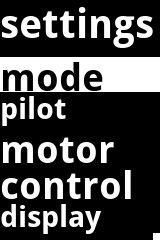

Le menu des paramètres comprend:

- mode - Ajuster le mode du pilote automatique (utile si la télécommande n'a pas de bouton de mode)
- pilot - Changer l'algorithme du pilote. La plupart des utilisateurs utiliseront le basic pilot

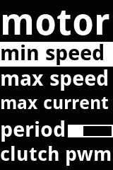 

- Motor - Ajuster les paramètres du moteur

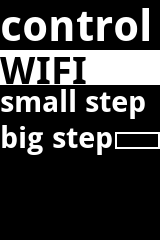

- Control - Ajuster les paramètres wifi, et les sauts pour les boutons - et +. Si les paramètres wifi sont changés, et que vous ne pouvez pas vous connecter, il est possible de revenir en mode AP en utilisant ce menu pour se reconnecter au pilo.

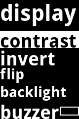

- Display - Ajuster différents paramètres pour l'affichage lcd
- Language - Sélectionner la langue utilisée pour le texte sur l'affic

### Info

 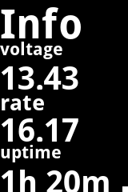  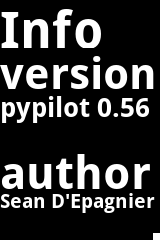

Les écrans d'information affichent des informations sur la version logicielle, la consommation d'énergie, la tension, la température, le temps d'exécution et les débits. Pour changer de page, utilisez les touches + et -.

## Interface de contrôle du pilote avec des télécommandes radio

Le pilote peut être contrôlé très sûrement avec des claviers radio étanches ou des télécommandes radio individuelles. Voir [télécommandes](#telecommandes-et-claviers-radio).

## Interface de contrôle du pilote avec OpenCpn en utilisant le plugin pypilot

Le plugin pypilot peut être utilisé pour configurer et contrôler le pilote automatique depuis OpenCPN sur une autre machine connectée au même réseau WiFi que le calculateur pypilot. Le plugin pypilot  offre une intégration spéciale et une interface de contrôle unique.

### Installation du plugin pypilot dans OpenCpn

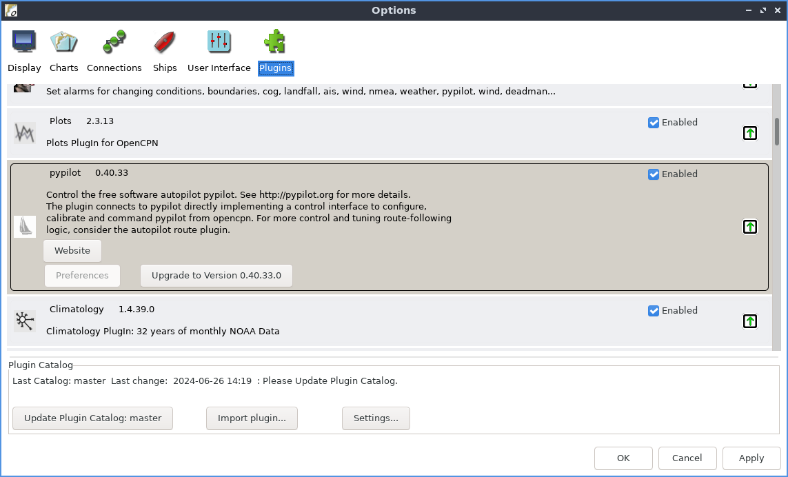

En général, le plugin pypilot peut être installé dans OpenCPN à l'aide du gestionnaire de plugins. La dernière version du plugin est la 0.51, mais les versions plus anciennes fonctionnent généralement. Il est également possible de créer le plugin à partir des sources pour une utilisation avancée. Associé au plugin de routage automatique, OpenCpn dirige les itinéraires de manière plus précise que l'algorithme de suivi d'itinéraire intégré.

Vous pouvez également envisager d'explorer le plugin de surveillance OpenCPN qui inclut des alarmes spécifiques à pypilot.

### Boîte de dialogue pypilot

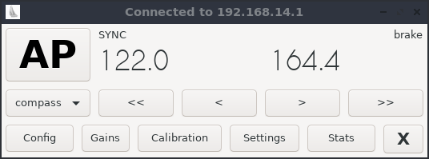 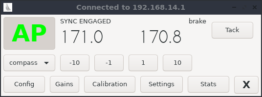

Lorsque vous cliquez sur l'icône pypilot de la barre d'outils, la boîte de dialogue pypilot s'affiche. La boîte de dialogue de base fournit un contrôle manuel, des changements de cap, des paramètres de mode, des virements de bord et des boutons pour ouvrir des boîtes de dialogue supplémentaires.

Les messages d’état relatifs à l’actionneur sont affichés en haut.

### Boîte de dialogue réglage des gains

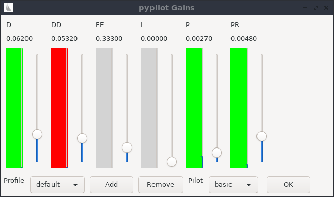

La boîte de dialogue de réglage des gains permet de visualiser et d'ajuster les gains. Chaque gain comporte un curseur vertical pour ajuster le réglage tandis qu’un bandeau animé indique la contribution de ce gain en temps réel. Par exemple, si le bandeau est rouge, il contribue à une correction vers tribord, et vers bâbord si le bandeau est vert. Si le bandeau est bleu, il a saturé. Cela signifie qu'il est au-delà du maximum qui correspond à la vitesse maximale avec laquelle le moteur peut faire tourner la barrer. Cela indique généralement que le gain est trop élevé, ou que le moteur est trop lent pour effectuer des corrections. Consultez « gains » pour obtenir des informations sur le réglage des gains.

Sous les gains, le profil peut être défini. Des profils peuvent également être ajoutés et supprimés ici. Ensuite, il existe une option pour choisir l’algorithme utilisé par le pilote. La plupart des utilisateurs utiliseront le pilote « basic » à ce stade

### Boîte de dialogue étalonnage

La boîte de dialogue étalonnage peut être utilisée pour visualiser l'étalonnage du pilote automatique.

### Boîte de dialogue paramétrage

Les paramètres les plus courants que les utilisateurs peuvent avoir besoin d'ajuster sont disponibles dans la boîte de dialogue des paramètres. Des paramètres supplémentaires peuvent être ajustés à l'aide du [client pypilot](#pypilot-client).

### Boîte de dialogue statistiques

Les statistiques peuvent être trouvées ici, y compris la version du logiciel, les temps d'exécution, la consommation électrique, la tension, les températures et les sources de données.

## Interface de contrôle du pilote par script python sur un système Linux distinct

Pypilot peut être configuré et contrôlé par des scripts python. Ces scripts sont installés lors de l'installation de pypilot et peuvent également être exécutés sur un système Linux distinct. Par exemple, le calculateur avec un Raspberry pi zero est connecté via le wifi à un autre système avec Openplotter, vous pouvez exécuter ces scripts sur le système openplotter pour contrôler pypilot. Vous pouvez également les installer sur un ordinateur portable Linux.

Pour la plupart des distributions Linux, ils peuvent être installés en installant pypilot, par exemple :
`git clone --depth 1 github.com/pypilot/pypilot
cd pypilot
sudo python3 setup.py install
`
Les scripts tenteront de détecter automatiquement pypilot, mais peuvent généralement aussi recevoir l'hôte ou l'adresse IP du pilote automatique à partir de la ligne de commande.

### Script pypilot_control

Le script pypilot_control est le script principal donnant le contrôle, l'état et les gains d'ajustement. Vous pouvez choisir le profil utilisé, l’algorithme du pilote et son mode (compas ici à l'écran).

En haut, les messages d’état du contrôleur de moteur sont affichés à gauche du bouton virement (tack).

### Script pypilot_scope

Vous pouvez exécuter le pypilot scope en exécutant pypilot_scope à partir de la ligne de commande. Le pypilot scope est un traceur graphique qui peut tracer en continu toutes les variables du pilote automatique.

Les touches suivantes sont prises en charge (vous pouvez avoir besoin de cliquer sur le graphique en premier lieu)

- Nombres 0,1,2..9 - Sélectionner la trace actuelle
- +/-   - Augmentation/diminution de l'échelle
- f – geler la trace/dégeler la trace
- p - point/lignes de tirage
- c – Centre la trace courante (modification du décalage)
- C - Centre toutes les traces
- v – Activer visibilité
- V – Activer toutes visibles
- z - réinitialisation du décalage de la trace à zéro
- Z - Réinitialisation des décalages de toutes les traces
- w - bascule fft
- UP/DOWN - décaler la trace courante vers le haut ou vers le bas (ajustement du décalage)

Choisissez bien les champs à surveiller, par exemple imu.gyro va tracer les axes des gyros. Il peut être utile par exemple de tracer ap.heading-error tout en ajustant les gains pour voir comment l'erreur de cap évolue au cours du temps.
You can run the pypilot scope by executing `pypilot_scope` from the command line.

### Script pypilot_calibration

Vous pouvez exécuter l'étalonnage pypilot en exécutant pypilot_calibration à partir de la ligne de commande.

## Interface de contrôle du pilote par navigateur Web

L'interface web pypilot permet de contrôler le pilote automatique à l'aide du navigateur de n’importe quel appareil raccordé par wifi au calculateur. Cela permet d’utiliser une grande diversité d’appareils (raspberry pi, tablette, pc, téléphone, etc..). 

Typiquement, l’adresse est http://Pypilot.io si le dns se résout, mais sinon l'adresse IP par défaut, lorsque pypilot est en mode AP, est http://192.168.14.1

Pour privilégier la disponibilité du pilote automatique au démarrage du calculateur de celui-ci, le chargement des systèmes nécessaires au web est retardé de quelques minutes. Ne soyez donc pas surpris si vous devez attendre après le démarrage de la connexion wifi pour que cette interface se charge.

L’interface web comporte différentes pages, décrites ci-dessous,  qu’on choisit avec la ligne de menu figurant tout en haut de chaque page

### Page web contrôle

La page de contrôle est le principal contrôle web du pypilot. Le cap et la consigne sont affichés en haut, et lorsque le pilote n'est pas activé, les boutons <<  <  >  >> sont affichés, et l’appui et le maintien de chaque bouton déplace manuellement le moteur. Si un capteur d’angle de barre est installé, un bouton supplémentaire s'affiche et peut être utilisé pour centrer la barre.

Le mode du pilote automatique peut être modifié avec la liste déroulante en dessous à gauche.

Au même niveau à droite (peut nécessiter un défilement sur de petits écrans), on trouve l'interrupteur à basculement AP(autopilot) enable/désactive. Appuyez simplement sur cet interrupteur pour le faire basculer. Il n’a pas besoin de glisser).	
Plus bas à gauche, d’autres statistiques et informations sont affichées

### Page web Gains – Choix du profil courant et réglages des gains

Cette page permet de changer de profil. On peut ainsi récupérer tous les gains et paramètres enregistrés avec ce profil. Elle permet aussi de modifier les gains du profil courant. Sur les appareils mobiles, les boutons << <  > >> peuvent être appuyés alors que sur les plus grands appareils,  on utilise un curseur. Voir [gains](#reglage-des-gains).

### Page web étalonnage

La page d'étalonnage est essentielle pour étalonner le pilote pour un fonctionnement correct. L'interface web propose un bouton permettant d’indiquer au calculateur que le bateau est de niveau pour initialiser les capteurs inertiels. Voir [Level](#initialisation-des-capteurs-inertiels-avec-le-bateau-de-niveau)

Il y a une zone de texte pour le décalage du compas, et des cases à cocher pour verrouiller l’étalonnage des accéléromètres et celui du compas.

Il y a aussi un lien vers le graphique de calibration (utile pour l'étalonnage des accéléromètres et du compas)

Enfin, le capteur d’angle de barre peut être étalonné en appuyant les boutons appropriés et en indiquant la plage de rotation du gouvernail, voir [étalonnage](#etalonnage-du-capteur-d’angle-de-barre)

Pour avoir plus d’information sur l’étalonnage, voir [instructions pour étalonnage](#instructions-pour-etalonnage)

### Page web configuration

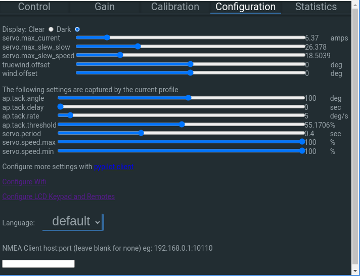

La page web de configuration permet de sélectionner "Clear" ou "Dark" qui n'affecte que l'affichage de l'interface web.

Ensuite, certains paramètres importants peuvent être définis. Ceux-ci sont répartis en 2 listes. Celle au-dessus contient les paramètres globaux s’appliquant à tous les profils, tandis que celle en dessous contient des paramètres qui, comme les gains, concernent uniquement le profil courant. Ces derniers paramètres changent si on change le profil courant. Voir [configuration des paramètres](#configuration-des-parametres)

Au-dessous des paramètres, il y a un lien #pypilot client vers le client pypilot qui permet de visualiser et d'ajuster tous les paramètres possibles.

Viennent ensuite les liens vers [Configurer le Wifi](#configurer-le-wifi) and [Configuration clavier LCD et télécommandes](#configuration-du-clavier-lcd-et-des-telecommandes)

#### Langue

La langue peut être détectée automatiquement pour le système exécutant le navigateur web, mais cela pourrait être indésirable ou gênant. Vous pouvez configurer manuellement la langue ici.

#### NMEA Client hostport

Certains routeurs ou systèmes NMEA ne peuvent pas se connecter au pypilot, et ont plutôt besoin de pypilot pour se connecter à eux en tant que client. Si c'est le cas, vous pouvez mettre l'adresse hôte ou IP : port à utiliser dans cette case. Normalement, il doit être laissé en blanc en particulier avec OpenCpn et le plugin Pypilot.

### Page web statistiques

La page de statistiques de l'interface web montre les statistiques sur la consommation et le fonctionnement.

## Configurer le Wifi

Un lien est prévu pour configurer le wifi à partir de l'onglet Configuration de la commande web. Par défaut, vous pouvez y accéder avec http://192.168.14.1/wifi ou dans un navigateur en utilisant le ip que le calculateur pypilot utilise. Cela ne s'applique qu'aux systèmes avec un calculateur pypilot. Si vous utilisez openplotter ou un autre système d'exploitation, se référer à leurs instructions pour configurer les réseaux sans fil.

Le calculateur du pilote automatique peut être configuré en mode client wifi, ou AP+client (où il agit comme un point d'accès ainsi qu'en client) ou un mode AP. Par défaut, il est en mode AP et les clients sans fil peuvent s'y connecter. Vous voudrez peut-être le passer en mode client pour l'intégrer à un réseau wifi existant, mais sachez que si vous ne connaissez pas l'adresse du client une fois qu'il s'est connecté, il pourrait être difficile d'y accéder. C'est la raison pour laquelle le mode AP-Client peut être utile car il fournit toujours le point d'accès.

Il est toutefois rapporté que ce mode n'est pas assez fiable, ce qui signifie que le mode AP-Client n'est probablement bon que pour accéder à l'appareil si le client ne peut pas être trouvé. Il est également possible de revenir au mode AP via l'interface de menu lcd, d'éditer le fichier de mise en réseau sur la carte sd, ou de refaire l’image de la carte SD. Veuillez être conscient des limitations et il est recommandé d'avoir accès à l'interface du menu lcd si le client wifi ne se connecte pas.

Si c'est le cas, connectez-vous, vous souhaiterez peut-être attribuer une adresse IP statique ou accéder à votre routeur pour trouver l'adresse IP attribuée au pilote automatique. Il est généralement possible de découvrir pypilot avec une autre machine sur le même réseau en utilisant également [pypilot client](#pypilot-client). Une autre option consiste à exécuter la commande « nmap » pour découvrir l'adresse attribuée. Une liste des clients connectés sera affichée dans un tableau

## Configuration du clavier LCD et des télécommandes

Le clavier LCD et les télécommandes peuvent être configurés via l'interface web. Il y a un lien vers cette page à partir de l'onglet Configuration de la commande web, ou typiquement il est possible d'accéder via : http://192.168.14.1:33333

### Programmation des télécommandes et claviers radio

Il existe de nombreuses fonctions différentes qui peuvent être attribuées à une touche particulière de télécommande radio. Ces touches peuvent être des boutons de télécommandes ou claviers radio voir même de télécommandes IR. Des fonctions peuvent également être affectées à des broches du GPIO du raspberry pi (utilisées par un chapeau de pypilot), ainsi qu’en appuyant sur plusieurs touches en même temps.

Les claviers radio pypilot utilisent des codes alternatifs (pour une meilleure fiabilité des appuis), de sorte que chaque fonction doit être programmée deux fois, mais ils peuvent généralement être automatiquement programmés s'ils sont détectés.

Les 7 premières fonctions de l’interface sont liées à l'interface du menu lcd. Leur fonction dépend de l'état de l'affichage. Elles sont donc destinées à être utilisées avec une télécommande ou un clavier radio installé en vue de l'écran. Il n'est pas conseillé d’affecter ces fonctions à des télécommandes ne permettant pas à l’utilisateur de voir l’écran. Leurs fonctions sont décrites  [ici](#entree-dans-le-menu-lcd)

Au-dessous de celles-ci, il existe d'autres fonctions qui peuvent être utilisées sans avoir besoin de voir l'affichage LCD du calculateur et qui devraient être associées aux télécommandes portatives ou les claviers radio installés sur le bateau à distance du calculateur.

### Entrées analogiques

Au moment de l'écriture de ce manuel, les entrées analogiques ne sont pas entièrement prises en charge, mais permettent des contrôles supplémentaires, par exemple le contrôle par joystick.

### IR (port de récepteur infrarouge)

Le port IR reçoit des signaux de télécommandes infrarouge. Tant le raspberry pi que l'arduino du calculateur sont capables de les décoder, mais avec certaines versions du logiciel, le raspberry pi ne les décode pas correctement, et il est difficile de programmer de nouveaux codes de télécommande. Pour cette raison, l'arduino peut être préférable. Si vous avez des difficultés à programmer une télécommande IR, essayez les deux options.

### Port RS422 NMEA

En plus de l’entrée USB pour échanger des données, le circuit imprimé du calculateur pypilot dispose de bornes à souder pour raccorder un port de données RS422 NMEA0183. C’est ce port qui peut être configuré ici pour activer/désactiver l'entrée et la sortie ainsi que pour régler la vitesse en bauds.

### Remote Mode pour commande avec des calculateurs supplémentaires

Il est possible d’utiliser un ou des calculateurs supplémentaires comme afficheur ou unité de contrôle du calculateur principal du pilote automatique. Sur chaque calculateur supplémentaire, il faut cocher la case « Remote Mode » et ajouter l’adresse IP du calculateur du pilote dans le champ de texte contre cette case. Une fois connectés en wifi avec le mode client au calculateur du pilote automatique, ils utilisent alors les données, l’IMU et le récepteur de télécommande du calculateur principal. Un deuxième calculateur pypilot, monté dans un emplacement différent, fournissant l'affichage LCD pourrait également fonctionner comme un pilote automatique de secours en désactivant le « Remote Mode » et en connectant la sortie du contrôleur de moteur à celui-ci si nécessaire.

### Informations sur les alimentations

En bas de l’écran de programmation des télécommandes et claviers, certaines statistiques incluant les tensions 5v et 3v3 sont affichées.

## Instructions pour étalonnage

L'étalonnage peut être effectué à partir de n'importe laquelle des interfaces de contrôle, mais il est recommandé d'ouvrir le tracé d'étalonnage dans le [pypilot OpenCPN plugin](#interface-de-controle-du-pilote-avec-opencpn-en-utilisant-le-plugin-pypilot), l'[interface web](#interface-de-controle-du-pilote-par-navigateur-web) ou le script [script pypilot_calibration](#script-pypilot_calibration) script.

Une fois étalon étalonné, le pypilot est prêt à être utilisé. 

### Etalonnage des accéléromètres

Typiquement, les calculateurs pypilot sont livrés avec les trois accéléromètres déjà calibrés, mais si vous avez écrit une nouvelle image sur la carte SD, c'est une bonne idée de renouveler cette étape.

Les pilotes les plus récents incluent les capteurs icm20948 dont les accéléromètres sont étalonnés en usine, mais beaucoup ont encore de petits décalages qui peuvent être compensés. Même si ce n’est pas indispensable, cela peut permettre d’améliorer la précision de la boussole de quelques degrés.

Pour étalonner les accéléromètres, il faut démonter le calculateur du bateau et disposer d’une surface  horizontale stable. Il est impossible de le faire à l'ancre si le bateau bouge trop. Une fois le calculateur alimenté en 5V par une alimentation USB-C, il faut le contrôler par wifi et lancer l’étalonnage de l’accéléromètre. 

S'assurer que l'étalonnage de l'accéléromètre n'est pas verrouillé et poser le calculateur successivement à plat sur chacune de ses six faces pendant quelques secondes. Une fois cela effectué, une mise à jour d'étalonnage peut être tentée toutes les 30 secondes. S'il y a une différence suffisante, les paramètres d'étalonnage seront mis à jour et indiqués sur l’écran d'étalonnage, si non, un message dans le journal d'étalonnage doit en indiquer la raison.

Une fois l'étalonnage fini, l'âge d'étalonnage de l'accéléromètre devrait se mettre à jour. Si ce n'est pas le cas, répéter le processus jusqu'à ce que l’âge se mette à jour. L’étalonnage des accéléromètres peut alors être verrouillé.. 

### Initialisation des capteurs inertiels avec le bateau de niveau

Si les accéléromètres sont étalonnés, le capteur peut être installé et fixé au bateau. Le bouton « boat is level » ne doit être appuyé que lorsque le bateau est de niveau et ne bouge pas. S'il est appuyé au mauvais moment, vous pouvez toujours réessayer quand le bateau sera de niveau. Une barre de progression indique l’avancement au fur et à mesure que les relevés des accéléromètres sont moyennés pour le calcul de l’initialisation des capteurs inertiels. Une fois les capteurs inertiels bien initialisés, les valeurs de tangage et de roulis devraient être presque nulles avec le bateau à plat. Cette opération est essentielle pour que le calculateur détermine un cap correct.

L’initialisation du capteur inertiel, avec le bateau de niveau, doit être effectuée avant de procéder à l'étalonnage du compas.

### Etalonnage du compas magnétique

Assurez-vous que le calculateur est bien installé conformément au [instructions de montage](#emplacement-du-calculateur-du-pilote-automatique) pour que les capteurs magnétiques de l’IMU ne soient pas anormalement perturbés.

L'étalonnage du compas magnétique est principalement automatique. Si les accéléromètres et le niveau des capteurs inertiels sont étalonnés, il suffit de naviguer en tournant plus de 240 degrés pour étalonner le compas. Attention si vous utilisez une nouvelle image sur la carte SD, il faudra beaucoup plus de rotations pour annuler la calibration de l’image. Dans ce cas, avant d’installer le calculateur pypilot sur le bateau, il est intéressant de profiter de la calibration des accéléromètres pour ensuite commencer une calibration du compas tant que les points ne font pas un cercle sur la sphère. 

S'assurer que l'étalonnage du compas n'est pas verrouillé car il ne pourra alors pas être actualisé. Le verrouillage peut être utile, une fois le compas correctement étalonné pour éviter les perpétuelles mises à jour avec de la mer agitée ou lors des virements de bord ou empannages rapides. Par mer peu agitée, le déverrouillage de l’étalonnage permet de le réactualiser.

Il existe à la fois des étalonnages de compas 2D et 3D. Une correction 2D apparaîtra en tournant sans tangage et sans gite. Lorsque le bateau gite, il peut y avoir une erreur sans correction 3D. Pour obtenir une correction 3D, vous devez faire un cercle avec une gite suffisante, comme tirer des bords contre le vent, ou naviguer avec du roulis dans les vagues.

Le correctif 2D est correct quand les points du graphique forment un cercle à la surface de la sphère. Ce cercle est plus ou moins haut sur la sphère en fonction de l’angle vertical d’inclinaison des lignes du champ magnétique terrestre.

Une autre façon d'obtenir une correction 3D est de démonter le calculateur et de le faire tourner manuellement près de son emplacement à bord du bateau, avec un peu de tangage et de roulis pour réaliser une première correction 3D. Une fois la correction 3D achevée, le calculateur peut être réinstallé sur le bateau. Après avoir réinitialisé le niveau (level boat) des capteurs inertiels avec le bateau de niveau et stable, il faut naviguer pour faire tourner le bateau sur plus de 240 degrès. Si une correction 2D est atteinte, le biais de polarisation de la solution 3D précédente sera utilisé. 

Les correctifs 2D suivants combineront celui-ci avec les informations du précédent correctif 3D, même grossier. L'exécution d'un étalonnage des accéléromètres et une rotation manuelle rapide permet ainsi d’obtenir un premier correctif 3D qui permettra dans la plupart des cas d’avoir un correctif 2D suffisant pour la plupart des utilisations.

L'étalonnage du compas est continu et toujours mis à jour à moins qu'il ne soit verrouillé. Vous voudrez peut-être le verrouiller pour éviter de futures mises à jour d'étalonnage.
Si des objets métalliques sont déplacés autour des capteurs, le compas doit être à nouveau étalonné en désactivant le verrouillage de l’étalonnage du compas.

ATTENTION : Le déplacement d’objets métalliques trop près des capteurs du calculateur, y compris certains inox légèrement magnétiques, peut provoquer des manœuvres inattendues, y compris des empannages intempestifs.

### Alignement du compas (Heading Offset)

Une fois le compas étalonné, un décalage de cap doit être entré en fonction de l'orientation du calculateur par rapport à l’axe du bateau. Sans cette correction, le pilote peut toujours suivre un cap, mais celui affiché ne correspondra pas au cap magnétique du bateau. Aligner le compas permet aussi d’avoir des valeurs de tangage et de roulis correctes. Par exemple, si le décalage de cap est de 90 degrés, les valeurs de tangage et de roulis affichées peuvent être inversées.

### Etalonnage du capteur de barre

Si un capteur d’angle de barre est installé, vous pouvez vérifier la page d'étalonnage du gouvernail pour lire la valeur et vous assurer qu'elle fonctionne. Pour étalonner la barre, vous devez tourner manuellement la barre de bâbord (Port) , à tribord (Starboard), et au centre et en appuyant sur le bouton correspondant pour chaque position. L'ordre n'est pas important. Le calcul du sens du capteur, de l'échelle, du décalage et de la non-linéarité se feront une fois que tous les trois auront été appuyés. Le champ "range" devrait être réglé manuellement pour indiquer l'angle réel à chaque position de plage et limiter le mouvement du pilote automatique au-delà de cette position.

Remarque: Il est possible de régler l’angle de barre à environ 35 degrés, et d'étalonner la barre en la déplaçant à 35 degrés dans chaque direction, puis de changer la « range » à 30 degrés pour limiter la course. Donc, pour être clair, la « plage de gouvernail » est destinée à l'étalonnage, quelle que soit la valeur lorsque le bouton est enfoncé, mais en fonctionnement, elle spécifie l'angle maximal auquel le contrôleur de moteur peut déplacer le gouvernail.

## Configuration des paramètres

### Profils

Pypilot prend en charge différents profils pour modifier rapidement les paramètres qui sont normalement ajustés en fonction des conditions. Ceux-ci incluent tous les gains ainsi que de nombreux paramètres de servo et de virement de bord. L'avantage est que si vous réglez le bateau sur des conditions particulières, vous pouvez créer un profil, puis le modifier à l'avenir lorsque vous naviguez dans les mêmes conditions. Mémoriser différents profils avec des paramètres pour une variété de conditions permet d’améliorer l’efficacité, la consommation d'énergie et même le bruit.

Par exemple, par vent faible, il peut être préférable de réduire le servo.speed_max à moins de 100 % pour réduire le bruit du moteur. Étant donné que la consommation d'énergie est déjà minimale par vent faible, bien que la plupart des variateurs soient globalement moins efficaces en dessous de la vitesse maximale, cela pourrait être un compromis utile pour avoir un pilote automatique silencieux. De même, par mauvais temps, il peut être judicieux de s'assurer que servo.speed_min et servo.speed_max sont à 100 % pour une maniabilité et une consommation d'énergie optimales.

Un autre exemple serait de réduire les gains, en particulier le gain P en naviguant au près, car de nombreux bateaux s'équilibrent naturellement. En effet, lorsque la force exercée par le gréement sur la coque augmente, le bateau tend à lofer avec la gite. Cependant, lorsque le bateau lofe trop, les voiles commencent à "déventer", réduisant leur force sur la coque, ce qui fait abattre le bateau. Pour cette raison, de nombreux bateaux peuvent avoir le gouvernail verrouillé au près et faire une route correcte tout en oscillant autour du cap moyen. Le pilote automatique est généralement bénéfique, en particulier dans les vagues, pour minimiser et amortir cet effet oscillant et améliorer la vitesse globale. Pour cette raison, il est judicieux de prévoir un profil pour le près avec un gain D plus élevé et un gain P plus faible.

### Paramètres du contrôleur moteur

Il existe différents paramètres du contrôleur qui affectent le contrôle et le fonctionnement du pilote automatique. Seuls les trois paramètres des deux premiers sous-paragraphes ci-dessous sont globaux et s'appliquent à tous les profils. Les autres concernent sont spécifiques au profil en cours d'utilisation.

####  servo.max_current

Le premier paramètre à ajuster est le servo.max_courant. Ce réglage ajuste la limitation de courant du contrôleur qui est utilisée comme détection de fin de course avec la plupart des actionneurs. Si la limitation de courant est réglée trop bas, des messages d’erreur « OVERCURRENT_FAULT » apparaissent constamment et bloquent le déplacement de l’actionneur. Si la valeur de courant saisie est trop haute, le contrôleur pourrait continuer à émettre de l'énergie avec l’actionneur en butée. Pour les actionneurs de barres, un réglage de 4 à 7 ampères est généralement correct, et pour les entraînements hydrauliques ou puissants, des valeurs plus élevées telles que 15 à 20 ampères devraient être utilisées.

#### servo.slew_speed  et  servo.slew_slow

Il s'agit essentiellement de l'accélération/décélération maximale de l’actionneur. Limiter l'accélération ou la décélération donne un mouvement plus progressif avec moins de pics de courant permettant de diminuer le réglage servo.max_courant. Mais si le réglage d’accélération/décélération est trop faible, le temps de réaction sera limité. Typiquement, des valeurs de 15 à 30 doivent être utilisées.

#### servo.period

Ce réglage est le temps minimum que le moteur peut tourner ou s’arrêter. Pour l'essentiel, il empêche le moteur de faire trop de mouvements courts. Des mouvements courts peuvent donner des corrections plus rapides et une meilleure direction, mais au détriment de l'usure et de la consommation d'énergie. Des valeurs typiques de 0,3 ou 0,4 fonctionnent bien pour la plupart des bateaux dans la plupart des conditions, mais les bateaux plus grands/plus lents ou les conditions plus légères peuvent utiliser des valeurs plus élevées, et les bateaux plus petits/plus rapides ou les conditions difficiles peuvent prendre en compte des valeurs plus petites.

#### servo.speed.min

Ce réglage limite la vitesse minimale que le moteur peut déplacer. Ceci est utile car de nombreux actionneurs électriques deviennent moins performants si le pilote fait tourner trop lentement le moteur, en raison d'un frottement important. Pour cette raison, il est généralement préférable d'effectuer de courtes et rapides corrections et de passer le reste du temps à ne pas bouger la barre. La fixation d'une vitesse minimale permet de se déplacer soit à cette vitesse, soit de rester à l'arrêt.

#### servo.speed.max

Ceci limite la vitesse maximale du moteur. Il peut être utile, dans des conditions plus légères, de ralentir le mouvement du gouvernail pour réduire le bruit ou l'usure. Habituellement plus le moteur d'entraînement est rapide, meilleures sont les performances, mais si les conditions sont bonnes, vous pouvez simplement limiter la vitesse d'entraînement en réduisant cette valeur. 

#### servo.use_brake

Lorsque le frein d’actionneur est activé, le contrôleur du moteur court-circuite le moteur lorsque le moteur ne tourne pas et que le pilote est engagé. Cela peut empêcher le gouvernail de forcer le moteur en cas de vent fort. Le frein est particulièrement utile sur les monocoques naviguant au près avec des gouvernails sur la quille ou l’étambot, non compensés. Pour d'autres utilisateurs, il est préférable de ne pas avoir de frein car cela vous permet de forcer rapidement l’actionneur, sans désengager le pilote ou la transmission, si vous devez éviter quelque chose.

### Réglage des gains

Le pilote automatique de base utilise un filtre PID amélioré pour former une boucle de rétroaction. Différents gains peuvent être ajustés pour améliorer les performances en fonction du bateau, de l’état de la mer et du type d’actionneur de la barre.

Les gains sont les suivants :

- P - proportionnel - erreur de cap
- I - intégrale - sur la base de l'erreur accumulée
- D - dérivée - taux de virage
- DD - dérivée' - taux du taux de virage
- PR - racine proportionnelle - racine carrée de l'erreur de cap
- FF - gain anticipé - changement de consigne de cap

Il est recommandé d'utiliser l'[opencpn plugin](#interface-de-controle-du-pilote-avec-opencpn-en-utilisant-le-plugin-pypilot), ou [pypilot_control](#script-pypilot_control) pour régler les gains car une rétroaction visuelle est fournie.

Pour commencer à partir de zéro (ou sur un nouveau bateau), régler tous les gains à zéro, à l'exception des gains P et D. Il est possible de disposer d'un pilote automatique utilisable avec uniquement ces deux gains, même si c’est moins efficace.

Placer le gain P à une valeur faible (par exemple .003) et le gain D à 0.01. Typiquement sur des bateaux plus grands, vous aurez besoin de valeurs plus élevées, mais c'est typiquement parce qu'ils ont des actionneurs de barre plus lents. Cela dépend vraiment de la vitesse à laquelle l’actionneur tourne la barre et des conditions de mer.

Le « hard over time » est le temps qu'il faut pour tourner la barre de butée en butée, soit généralement 30 degrés de part et d’autre. Si un moteur plus petit est d’avantage démultiplié et qu’il faut, par exemple, 16 secondes, alors ces gains devraient être doublés à P .006 et D .02 comme réglage de départ.

Si le bateau met trop de temps pour corriger le cap et passe beaucoup de temps d’un côté du bon cap, augmentez ces deux gains. Si le moteur travaille trop dur et franchit souvent le cap correct, diminuez ces gains.

- P - gain proportionnel - Cette valeur devrait normalement être fixée à un faible niveau. S'il est trop haut, le bateau tournera constamment à travers le cap souhaité. S'il est trop bas, le bateau peut ne pas maintenir la route. Au fur et à mesure qu'il est augmenté, un gain D plus élevé est nécessaire pour compenser (prévenir le dépassement).

- I - gain intégral - Ce gain n'a pas besoin d'être utilisé pour maintenir un cap, mais il peut compenser si le cap obtenu est différent du cap souhaité. Si vous suivez des itinéraires et que le bateau a tendance à suivre une ligne parallèle à l'itinéraire, cela compensera cette erreur. Il est préférable de commencer à zéro et de l'augmenter doucement jusqu'à ce que les résultats soient améliorés. Si la valeur est trop élevée, cela augmentera simplement la consommation d'énergie. La plupart des utilisateurs peuvent utiliser une valeur de 0 (désactivé) avec de bons résultats.

- D - gain dérivé - Il s'agit du gain utilisant la vitesse de rotation déterminée par les gyromètres. C’est le principal gain utilisé par le pilote. La plupart des corrections devraient résulter de ce gain. Une fois que la meilleure valeur est trouvée, il peut généralement fonctionner dans une gamme de conditions, cependant, dans de l'air léger, il peut être réduit (avec la réduction d'autres gains) pour réduire significativement la consommation d'énergie, en particulier si le bateau est bien équilibré.

- DD - gain dérivé’ - Ce gain est utile pour améliorer le temps de réaction et réduire les oscillations. Il peut permettre des corrections plus tôt qu'elles ne se produiraient à partir du seul gain D. Essayer d’augmenter progressivement cette valeur, sans modifier les autres gains et sans dépasser 1,5 fois la valeur de gain D.

- PR - gain de racine proportionnel - Ce gain peut être vraiment utile pour éviter l'oscillation, en particulier au près. Pour l'utiliser, augmentez-le jusqu'à ce qu'il prenne effet, et diminuez progressivement le gain P. Vous aurez toujours besoin d'un gain de P, mais il peut être réduit de moitié si un gain PR suffisant est utilisé. La dérivée 1/2 d'une fonction linéaire est en fait de 2 x carré. Donc, dans un sens, ce gain imite le filtre dérivé fractionnaire PID en fournissant un composant fractionnaire utile à mélanger dans la correction. Il aide à produire une réponse amortie car il n'est souvent pas très bon de mettre à l’échelle la rétroaction de manière linéaire avec l'erreur de cap, car cela peut produire un dépassement. J'ai généralement réglé ce gain à 1-2x le gain P, ce qui permet un gain P plus faible et réduit les dépassements.

- FF - gain anticipé - Ce gain est uniquement utilisé lorsque l’on modifie la consigne de cap. Pour suivre un cap, il n’est pas utilisé. Suivre une route peut entraîner des changements de cap et ce gain sera alors utilisé. Le gain FF peut être très utile pour améliorer le temps de réponse car une valeur P faible est souhaitable pour suivre un cap. Les importantes modifications de cap peuvent prendre beaucoup de temps sans le gain FF. Ce gain a la principale contribution lorsque la consigne est modifiée.

#### Conseils

- Au près :  moins de gain de D, plus de gain P (ou PR)
- Portant : more D gain, and possibly add DD gain
- Vent faible : moins de gains - économiser l'énergie
- Vent fort : plus de gains - plus de gains nécessaires pour fonctionner correctement

Par mer plate, suivre une route moins droite est une erreur de réglage qui ne fera qu'augmenter la consommation électrique.

Par mer agitée, tolérer une direction moins droite peut diminuer la consommation électrique si vous voulez simplement garder le cap moyen désiré avec les voiles bordées. C'était toujours l'objectif avec un régulateur d’allure. Cela permet aussi de diminuer l'usure du moteur de l’actionneur.

#### Explications complémentaire sur les valeurs des gains

Les unités peuvent sembler arbitraires, mais pour clarifier, une valeur de gain P de 0,003 revient à déplacer la barre à 0,3 % de sa vitesse maximale pour chaque degré d'erreur de cap. Donc, si le bateau a un écart de route de 10 degrés, il déplacerait l'actionneur à 3% de la vitesse maximale en moyenne. Comme l’actionneur se déplace en rafales, il pourrait procéder à une légère correction pendant 0,3 seconde toutes les 10 secondes. Le gain P contribue généralement à une petite fraction de la correction globale, mais combiné au gain PR (généralement un peu plus élevé), l'effet est suffisant pour maintenir la trajectoire. Par comparaison, un gain D d'une valeur de 0,06 fait tourner la barre à 6 % de la vitesse maximale en moyenne pour chaque degré par seconde de rotation du bateau. Donc, si le bateau fait une rotation de 5 degrés par seconde, cela pourrait se traduire par le déplacement du gouvernail à pleine vitesse 30 % du temps (selon les limites d'asservissement de vitesse). 

Les autres gains sont calculés de la même manière.

## Fonctionnement (engager/dégager, modes de tenue de cap, virement, algorithmes)

### Engager/désengager

Le fonctionnement le plus basique est d’engager/désengager le pilote automatique. Cela peut se faire en utilisant l'interface de commande choisie. Une fois le pilote engagé, l'affichage lcd ne montre plus "veille" mais la consigne de cap. Le contrôleur du moteur doit s'allumer en bleu ou en blanc, en indiquant qu'il commande le moteur. Lorsque le pilote est désengagé, une commande manuelle est possible pour déplacer l’actionneur à l'aide des boutons ou de l'entrée de commande. Lorsque le pilote est engagé, la même interface ajuste à la place la consigne de cap.

Lorsque le pilote est engagé, la consigne de cap est initialisée au cap du bateau

### Modes de tenue du cap

Le pilote automatique prend en charge différents modes de tenue d'un cap selon les capteurs ou infos dont dispose le calculateur

#### Mode Compas

Le mode Compas est le mode le plus basique qui est toujours supporté en raison des capteurs magnétiques internes. Il permet de maintenir le cap magnétique du bateau. D'autres modes peuvent se rabattre sur ce mode compas si les données nécessaires ne sont pas disponibles. Lorsque l'on commence à utiliser le pilote, il est préférable d'essayer ce mode et de s'assurer qu'il fonctionne correctement, car d'autres modes reposent aussi sur le compas magnétique du calculateur pour fonctionner correctement.

#### Mode GPS

Le mode GPS utilise le cap gps CSOG pour ajuster l'orientation du bateau. Cela permet au bateau de se déplacer dans une direction par rapport au nord géographique. Ce n'est peut-être pas la direction vers laquelle le bateau fait face (dérive et courants), mais cela peut être utile pour s'assurer que le bateau se déplace dans une direction particulière par rapport au sol. Si le compas présente des variations importantes, ce mode peut quelque peu aider à compenser, mais en raison du faible débit de sortie de la plupart des GPS, le compas et les gyromètres sont toujours utilisés pour corriger le mouvement du bateau, et le GPS est utilisé à un rythme plus lent pour garantir que ces corrections maintiennent le bateau dans la bonne direction.

#### Mode NAV

Le mode NAV est très similaire au mode GPS, sauf que si un traceur externe tel qu'OpenCPN envoie des messages de relèvement du pilote automatique (APB) au pilote, il ajustera la commande de cap pour les suivre. Cela permet de se diriger vers des itinéraires. Il peut être utile de noter que si ce mode apparaît comme disponible, le pilote reçoit de tels messages, mais vous pouvez également passer à un mode différent pour les ignorer.

#### Mode Vent

Le mode Vent utilise le vent apparent de la girouette. Cela permet de maintenir le bateau orienté dans un angle particulier par rapport au vent apparent. Il est possible de régler et d'atténuer les capteurs de vent s'ils sont bruyants, mais en général, ce mode est surtout utile lorsque vous naviguez au près et avec des vents changeants.

#### Mode Vent réel

Le mode vent réel combine le vent apparent de la girouette et la vitesse sur l'eau (ou la vitesse GPS s'il n'y a pas de speedo) pour calculer le vent réel sur l'eau (ou le sol). Le pilote automatique dirige ensuite le bateau selon cet angle. Ce mode est particulièrement utile lorsque vous naviguez au portant, car les accélérations soudaines peuvent grandement affecter la direction du vent apparent. Le mode vent réel permet de mieux stabiliser la route du bateau au portant.

### Virement de bord

La fonction de virement de bord(tacking) facilite le virement du bateau sous pilote automatique. Lors de l'utilisation des télécommandes, il existe généralement différents paramètres de virement de bord :

#### ap.tack.delay

Cette valeur indique simplement le temps pendant lequel pypilot attendra à partir du moment où le virement de bord est commandé avant de lancer la routine de virement de bord. Elle peut être utile pour permettre à l'utilisateur de se préparer à larguer l'écoute au bon moment. Sur les bateaux plus petits, il peut être plus simple d'utiliser une valeur de 0 (pas de délai).

#### ap.tack.angle

Il s'agit simplement de l'angle de virement de bord. Les valeurs typiques sont de 90 à 120, mais elles peuvent varier en fonction du bateau, de la vitesse du vent et de l'état de la mer. En mode vent, l'angle actuel sera reflété plutôt que d'utiliser cette valeur.

#### tack.rate

Il s'agit de la vitesse à laquelle le bateau doit faire tourner le bateau dans le virement de bord en degrés par seconde. En général, vous pouvez simplement définir cette valeur à un niveau élevé et le bateau virera de bord aussi vite que possible (le gouvernail se déplace pour limiter rapidement).

#### tack.threshold

Cette valeur définit le point auquel le pilote passe du virement de bord au suivi de cap. Par exemple, un seuil de 100 % dépassera probablement le seuil car le bateau n'arrêtera pas de virer de bord avant d'avoir atteint la cible. Une valeur de 50 % permet de maintenir le nouveau cap lorsque le bateau est directement face au vent, ce qui est généralement une bonne valeur de départ (puisque le bateau tourne déjà). Pour les bateaux qui réagissent rapidement avec de petites vagues, des valeurs encore plus basses peuvent être utiles pour éviter de dépasser le virement de bord.

En résumé, un seuil trop élevé tend à dépasser le virement de bord, tandis qu'un seuil trop bas peut entraîner un sous-virage (le bateau ne parvient pas à virer de bord ou vire de bord trop lentement).

### Pilote (algorithme de pilotage)

Pypilot prend en charge divers algorithmes de pilotage. Le pilote de base « basic » est de loin le pilote le plus utilisé et le plus éprouvé. Il utilise un filtre PID étendu pour intégrer la racine carrée et le retour d'information de second ordre. D'autres pilotes peuvent avoir des capacités différentes, comme ignorer complètement les capteurs magnétiques ou utiliser le retour d'information du gouvernail directement dans la boucle de contrôle. Ces pilotes peuvent avoir besoin de recourir au pilote de base si leurs entrées requises ne sont pas disponibles. Il est donc essentiel de garantir que les performances sont adéquates à l'aide du pilote de base.

## Formats de données pris en charge

### NMEA0183

Il s'agit de la norme marine la plus universelle et les phrases suivantes peuvent être reçues :
- MWV : vent apparent et vrai
- VWR : vent apparent (héritage alternatif)
- VWT : vent vrai (héritage alternatif)
- APB : relèvement du pilote automatique pour le suivi de route
- VWH : vitesse de l'eau
- LWY : dérive
- RMC : gps
- RSA : angle de barre (il est préférable d'utiliser un capteur de gouvernail directement raccordé au contrôleur du moteur)

Les phrases suivantes peuvent être générées :
- MWV : après calibrage
- RSA : angle de barree
- RMC : si le filtre GPS combine les données IMU et GPS, cela peut fournir une sortie à grande vitesse pour la vitesse/la trace 
- XDR : tangage et roulis
- HDM : cap magnétique
- ROT : taux de rotation angulaire

Les connexions nmea0183 se font soit sur des ports série, des ports USB, soit via wifi. Si la connexion est un port série ou un port de communication virtuel, elle sera détectée avec un débit de 4800 ou 38400 bauds. Les phrases reçues via USB/série non utilisées par le pilote automatique seront relayées aux appareils connectés au Wi-Fi.

La connexion Wi-Fi pour les données nmea0183 écoute le port 20220.

Il est possible d'établir simplement une connexion à ce port dans un programme comme OpenCPN, cependant le plugin pypilot OpenCPN a une option pour détecter automatiquement pypilot et établir automatiquement la connexion et si elle est activée, une connexion en double ne doit pas être établie.

Il est possible de surveiller les phrases NMEA simplement en utilisant netcat, par exemple : 
nc 192.168.14.1 20220

Il est également possible de configurer un [nmea client](#nmea-client-hostport).

Normalement, les données reçues via Wi-Fi ne sont pas relayées vers d'autres connexions Wi-Fi, bien qu'il soit possible de contourner cela en envoyant un message $PYPBS*48 à la connexion.

### SignalK

SignalK est un format alternatif de données marines ouvert. Il s'appuie généralement sur une instance du serveur signalk-node-server pour distribuer les données. Pypilot peut détecter ce serveur sur le réseau automatiquement et commencer à recevoir des données de celui-ci pour des éléments tels que le vent ou le GPS, cependant pour que pypilot puisse envoyer des données à signalk, il doit y avoir accès. Si vous exécutez openplotter, le serveur signalk est normalement activé. Connectez-vous au serveur signalk dans un navigateur, par exemple http://10.10.10.1:3000
Connectez-vous avec les privilèges d'administrateur et recherchez « Demandes d'accès » dans le menu de gauche. Si pypilot est en mesure de le faire, il demandera l'accès et, s'il dispose d'un accès en lecture/écriture, pypilot pourra envoyer des données au serveur signak.

Les clés suivantes de SignalK sont prises en charge :

- environment.wind.speedApparent - vitesse du vent apparent
- environment.wind.angleApparent - angle du vent apparent
- environment.wind.speedTrue - vitesse  du vent réel
- environment.wind.angleTrue - angle du vent réel
- navigation.courseOverGroundTrue - cap gps
- navigation.speedOverGround - vitesse gps
- navigation.position - position gps
- steering.rudderAngle - angle de barre
- steering.autopilot.target.headingTrue - cap cible du pilote automatique
- navigation.headingMagnetic - cap compas magnétique
- navigation.attitude - tangage, roulis et lacet
- navigation.rateOfTurn - taux de virage
- navigation.speedThroughWater - vitesse sur l'eau
- navigation.leewayAngle - dérive

## Utilisation avancée

Cette section décrit certaines fonctionnalités plus avancées qui ne sont généralement pas nécessaires pour une utilisation normale.

### SSH access

Le calculateur du pilote automatique est accessible via SSH. Le nom d'utilisateur de connexion normal de tinypilot est "tc" avec un mot de passe "pypilot" par exemple :

`ssh tc@192.168.14.1`
`password: pypilot`
`$`

Une fois le shell accessible, il est possible d'exécuter diverses commandes directement sur le shell

### Visualisation des fichiers journaux (log files)

Les fichiers journaux peuvent être consultés à partir de l'interface web, par exemple:
http://192.168.14.1/logs

Mais aussi par l'intermédiaire du shell :
$ cd /var/log/
$ ls

Chaque service a un répertoire, dans ce dossier le dernier journal est "current" par exemple:
`cd /var/log/pypilot/current`
`cat current`

Vous pouvez également récupérer les fichiers journaux à distance en utilisant scp 
`scp tc@192.168.14.1:/var/log/pypilot/current .`

### pypilot Client

Le pypilot_client permet de contrôler l'état et le pilotage automatique à l'aide d'un simple outil de ligne de commande. Cet outil ainsi que d'autres peuvent être installés sur la plupart des distributions Linux en installant les [python scripts](#interface-de-controle-du-pilote-par-script-python-sur-un-systeme-linux-distinct).

Sans paramètres, toutes les valeurs pypilot possibles sont répertoriées.

Si un paramètre est passé en argument, il peut être lu ou défini, par exemple, pour permettre l'exécution du pilote automatique :

`pypilot_client ap.enabled=true`

Les commutateurs de ligne de commande suivants sont pris en charge :
- `-c` surveillance continue
- `-i` produire une sortie détaillée pour la valeur particulière
- `-h` imprimer un message d'information.

Il existe également une implémentation graphique du client qui peut être exécutée avec `pypilot_scope_wx` La fonctionnalité client pypilot graphique est également intégrée à l'interface Web ainsi qu'au plugin OpenCpn pypilot.

### Enregistrement des données

Il est possible de surveiller et d’enregistrer les données du pilote automatique à l'aide de l'outil de commande `pypilot_client`.

Par exemple, pour voir les données des gyromètres : `pypilot_client -c imu.gyro`

La sortie peut être redirigée vers un fichier pour l’enregistre, par exemple : `pypilot_client -c rudder.angle > rudder_log`

### Reconstruction de l'application pypilot

Pour la plupart des utilisateurs, il est préférable de ré-imager la carte SD pour mettre à niveau le logiciel pypilot car cela garantit que l'ensemble du système est dans un nouvel état connu, y compris tous les paramètres. Il est cependant possible de mettre à jour uniquement le paquet pypilot et de le reconstruire sur le calculateur du pilote automatique. Pour ce faire, se connecter au calculateur pypilot via ssh :
`ssh tc@pypilot.io`
`cd pypilot`
`git pull username@remote:pypilot`
`. pypilot.build`
`reboot`

Avant d'exécuter ce script, s'assurer que le pypilot est entièrement booté, par exemple : `cat /tmp/bootlocal.log` doit répondre "done".

Souvent, vous ne pouvez pas obtenir directement du github sur le calculateur à cause du support de sécurité. Il est alors nécessaire de passer par une machine sur le réseau local. Si ces commandes sont exécutées, le système mettra à jour pypilot. Il est essentiel d'effectuer cette étape pour modifier le code source.

Vous pouvez aussi tester les changements sans reconstruction en arrêtant d'abord le pypilot, et en l'exécutant directement :

`sudo sv d pypilot`
`cd pypilot/pypilot`
`python3 autopilot.py`

C’est le moyen le plus rapide pour tester les nouveaux changements et, lorsque la construction du paquet sera vérifiée, les modifications seront utilisées lors du redémarrage.

Si vous éditez des scripts de démarrage, par exemple dans /opt, les modifications ne seront pas stockées sur le boot de la carte SD  sauf si
 `filetool.sh -b` est exécuté.

### Activer des algorithmes supplémentaires de pilote automatique

Dans le dossier pypilot/Pypilot/pilots, il y a plusieurs algorithmes de pilotes qui sont désactivés par défaut. En éditant le fichier python pour commenter la ligne `disabled = True`, la reconstruction ou le redémarrage de pypilot permettra de les activer pour les tester.

### Format des données de pypilot

Pypilot a son propre format de données utilisé en interne mais aussi pour communiquer avec des programmes distants. Par example, le plugin OpenCPN pypilot communique en utilisant ce format. Le port tcp utilisé est 23322 et le format est une simple valeur clé pour l'attribution ou la récupération de données. Pour obtenir ou regarder une clé particulière vous devez envoyer `watch={"key":0}` ou remplacer 0 par la période.

## Mise à niveau du logiciel

Le logiciel peut être mis à jour via ssh à des fins de développement, mais le moyen le plus fiable de mettre à jour le logiciel est de réécrire la carte SD avec une image parce que tout le système est mis à jour dans un état stable, y compris les fichiers de configurations. Il est recommandé d'utiliser une nouvelle carte SD pour pouvoir facilement revenir en arrière en remettant l’ancienne. Conservez cette dernière jusqu'à ce que le nouveau logiciel soit vérifié et fonctionne bien. Si on efface la carte SD, il est prudent de conserver au moins une copie de l’ancien fichier pypilot.conf pour pouvoir consulter ultérieurement les anciens réglages.

L'image peut être téléchargée à partir de pypilot.org/downloads. Des instructions pour la mise à jour de l'image s'y trouvent. Avec linux ou windows, on peut utiliser l’application Raspberry Pi Imager. Dans la liste déroulante « Système d’exploitation », il faut choisir « use custom » , puis sélectionner le fichier image téléchargé.

# Technique et assistance

## Choix de conception

### Type de capteurs

L'icm20948 est un successeur du mpu9255. Il est prouvé que ces capteurs disposent de données adéquates pour la navigation inertielle. Le principal avantage que j'ai trouvé dans l'icm20948 est un meilleur contrôle de la qualité de fabrication par rapport au mpu9255, mais les capteurs eux-mêmes sont similaires en termes de performances.

L'une des caractéristiques les plus importantes est l'utilisation de capteurs à effet hall, comme magnétomètres, à la place des capteurs magnéto résistifs. Les capteurs à effet Hall ne sont pas aussi sensibles mais sont beaucoup plus répétables. Ils sont suffisamment sensibles pour le compas et la répétabilité est plus importante que la sensibilité.

### Conception des logiciels

Pypilot est écrit en python. Ce langage n'est ni le plus rapide ni le plus efficace, ni le plus facile à intégrer à certaines interfaces, pas plus qu'il n'est capable d'exprimer des algorithmes de la manière la plus élégante. Ce qu'il peut faire, c'est fournir un langage sûr qui tend à jeter des exceptions compréhensibles, être relativement facile à comprendre et à modifier pour beaucoup de gens, et d'assurer une bonne intégration aux bibliothèques mathématiques, scientifiques et autres. Les parties critiques les plus performantes de pypilot sont implémentées en c++ et appelées depuis python.

Les avantages de python incluent la capacité de développer rapidement le programme sans attendre de recompiler et d'éviter les accidents inexpliqués tout en ayant des performances suffisantes pour fonctionner sur des processeurs modernes à faible coût. Le logiciel lui-même utilise le multitraitement. Cela peut tirer parti de plusieurs processeurs de base, mais plus important encore, sépare la logique du pilote automatique en programmes distincts qui communiquent entre eux et peuvent être programmés avec des priorités différentes. Par exemple, les principales boucles de contrôle et les capteurs inertiels ont une priorité en temps réel pour garantir de bonnes performances tandis que la manipulation des données est plus tranquille et peut fonctionner avec un processus normal alors que des routines d'étalonnage peuvent utiliser le temps de repos ou de secours.

### Conception du matériel

Le contrôleur de moteur du pilote automatique est séparé du calculateur pour sa fiabilité et assurer une conception modulaire permettant d'utiliser le contrôleur  adapté à l'actionneur utilisé.

## Description mécanique

### Calculateur pypilot

- Dimensions du boîtier : 85 x 58 x 33mm
- Plastique ABS
- Longueur totale avec pattes de montage et presse-étoupe : 115 x 85mm
- 3 presse-étoupes PG7 vers contrôleur de moteur, alimentation 5V USB-C, interface USB
- Antenne filaire 433 mhz pour le récepteur de télécommande

### Contrôleur de moteur

Dimensions du circuit imprimé :
- Contrôleur 7A de moteur 77 x 51mm
- Contrôleur de moteur de puissance intermédiaire 104 x 72mm
- Contrôleur de moteur de puissance intermédiaire 116 x 87mm

### Bôitiers optionnels des contrôleurs de moteur

Les boîtiers imprimés en 3D pour les contrôleurs de moteur ne sont pas étanches à l'eau mais empêchent la poussière et la contamination tout en permettant une circulation d'air pour le refroidissement. Il est possible de monter les contrôleurs de moteur dans des boîtiers étanches à l'eau en utilisant des presse-étoupes pour chaque fil d'alimentation et un presse-étoupe pour le câble de données, mais le boîtier doit être légèrement plus grand pour dissiper la chaleur.

#### Boîtier pour contrôleur de moteur 7A

   

#### Boîtier pour contrôleur de moteur de puissance intermédiaire

   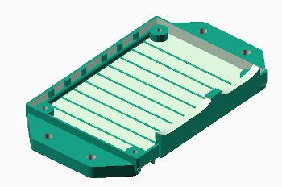

#### Boîtier pour contrôleur de moteur de forte puissance

   

### Capteur d'angle de barre

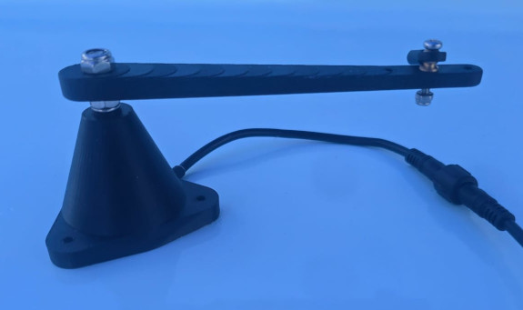

Le capteur d’angle de barre se compose d'un corps imprimé 3d équipé de paliers en delrin. L’arbre inoxydable tourne à travers ces paliers avec un jeu adapté. L'extrémité de l'arbre a un aimant magnétisé diamétralement qui se trouve juste au-dessus d’un capteur angulaire à effet Hall enrobé dans la résine (mlx90316), garantissant que l'ensemble est étanche à l'eau et ne risque pas de s'user dans le temps. Le bras du capteur doit être actionné mécaniquement par la barre. Le capteur est fourni avec deux rotules pour tige filetée de 3mm dont l’une est fixée au bras du capteur et l’autre doit être fixée au système de barre. Plus le bras de levier est long, moins le jeu affecte le retour du gouvernail. Les rotules doivent être reliées par une tige filetée M3 non fournie.

## Specifications techniques

### Specifications de puissance consommée

| Product                  | Voltage    | Idle Current | Idle Power | Max Current |
| ------------------------ | ---------- | ------------ | ---------- | ------- - |
| pypilot computer         | USB-C (5v) | 180mA        | 850mW      | 280mA |
| pypilot motor controller | 9-16v      | 5mA          | 60mW       | 7A      |
| mid power motor controller | 9-32v | 2mA | 24mW | 15A |
| high power motor controller | 9-32v | 2mA | 24mW | 30A |
| pypilot rudder feedback | 5v | 14mA | 67mW | 14mA |
| control panel | 9-40v | 3.5mA | 42mW | 20mA |
| rs422 usb isolator | 5v | ... | ... | ... |

L'un des composants les plus susceptibles de tomber en panne dans le temps sont les condensateurs électrolytiques car ils peuvent s'assécher au fil du temps, en particulier avec de la chaleur. Pour cette raison, j'ai sélectionné des condensateurs de 63V, même pour les systèmes en 12 volts car la plus grande taille assure qu'ils dissipent la chaleur et fonctionnent à une température plus basse. En outre, les condensateurs à tension plus élevée ont tendance à avoir une durée de vie plus longue.

## Fusible et résistance interne du contrôleur de moteur

Les contrôleurs de moteur, largement dimensionnés, sont tous équipés des protections suivantes :

- Protection contre l’inversion de polarité de l’alimentation
- Protection contre les surtensions rapides par TVS de toutes les entrées et sorties 
- Fusible à l’entrée de l’alimentation (voir tableau)
- Protection par polyfuse de la sortie embrayage (clutch)

| Produit | Fusible | Resistance interne |
| - | - | - |
| pypilot motor controller   | 10A | <50mΩ |
| midpower motor controller  | 20A | <35mΩ |
| highpower motor controller | 30A | <20mΩ |

## Assistance supplémentaire

### Soulever des questions sur github

Pour les bogues logiciels importants, il est possible d’évoquer un problème sur [github](https://github.com/pypilot/pypilot/issues). S'il vous plaît, ne posez pas de questions sur Github pour demander de nouvelles fonctionnalités ou poser des questions sur la façon d'utiliser le logiciel.

### Forum pypilot sur openmarine

Le [forum pypilot](https://forum.openmarine.net/forumdisplay.php?fid=17) est la meilleure façon de discuter du pypilot. Comme il s'agit d'un forum public, d'autres utilisateurs peuvent s'entraider, et les discussions pourront être recherchées à l'avenir. Il s'agit à la fois de dépannage et de problèmes, mais il existe un forum distinct pour les [demandes de nouvelles fonctionalités](https://forum.openmarine.net/forumdisplay.php?fid=21) et un autre pour l'affichage [d'annonces](https://forum.openmarine.net/forumdisplay.php?fid=25) d'achat et de vente de matériel pypilot usagé.

### Contacter l'auteur

L'auteur peut être contacté par courriel pour discuter du pypilot. Il est préférable d'inclure le pypilot dans l’objet du message pour éviter les filtres spam. Les coordonnées peuvent être consultées sur pypilot.org

# Annexe A - Message d'état du contrôleur moteur

- SYNC - le calculateur et le contrôleur moteur communiquent
- OVERTEMP_FAULT  - le contrôleur moteur ou le moteur ont dépassé les limites de température
- OVERCURRENT_FAULT - la limitation de courant a été déclenchée
- ENGAGED - le contrôleur reçoit des commandes du calculateur pour contrôler la barre
- INVALID - le contrôleur a reçu des données non valides, cela indique un problème de données
- PORT_PIN_FAULT - le capteur de fin de course vers bâbord est activé (contact fermé)
- STARBOARD_PIN_FAULT - le capteur de fin de course vers tribord est activé (contact fermé)
- BADVOLTAGE_FAULT - la tension lue par le contrôleur moteur est en dehors de la plage correcte
- MIN_RUDDER_FAULT - le retour de gouvernail a atteint la valeur minimale
- MAX_RUDDER_FAULT - le retour de gouvernail a atteint la valeur maximale 
- BAD_FUSES - les fusibles du contrôleur moteur ne sont pas programmés correctement
- PORT_OVERCURRENT_FAULT - indique que limitation de courant a été déclenchée lors du déplacement vers bâbord et que le moteur ne se déplacera pas plus loin dans cette direction
- STARBOARD_OVERCURRENT_FAULT - indique que limitation de courant a été déclenchée lors du déplacement vers tribord et que le moteur ne se déplacera pas plus loin dans cette direction
- DRIVER_TIMEOUT - le moteur reçoit l'ordre de se déplacer, mais aucun courant n'est mesuré, peut être ignoré si le retour de courant ne fonctionne pas sur le contrôleur de moteur
- SATURATED - le moteur reçoit l'ordre de se déplacer plus vite qu'il ne le peut, il ne peut pas suivre, ce qui indique qu'un moteur plus rapide améliorerait la direction
- REBOOTED - le contrôleur de moteur a redémarré

# Annexe B - Erreurs affichées

This is a list of possible errors displayed on the LCD screen

- No IMU - le capteur inertiel  n’est pas détecté
- IMU Failed - les capteurs inertiels sont détectés mais incapables de communiquer
- IMU waiting on axes - un ou plusieurs des axes des capteurs inertiels ne fonctionnent pas
- WARNING no motor controller - incapacité à communiquer avec le contrôleur du moteur

