# Introduction

## Motivation

I have always relied on autosteering.  Mechanical vanes have limitations, and as I looked for free software solutions I found limited options.  For this reason pypilot was created to offer an autopilot we can all trust and extend and modify to fit our needs.

## Philisophy

pypilot is free software (GPLv3) and as such you can trust it both to steer as intended and for future use without restrictions.  Because the freedom to modify is guarenteed, users from around the world continuously contributed improvements, even small ones to the benefit of all users.

# Hardware and Installation

## Mounting Instructions

Find a good location on the boat to mount the autopilot computer.  While the pypilot computers do come in a waterproof enclosure, it is wise to mount the unit inside the boat to protect it from the elements.   If you were to mount it outside, consider additional protection (clear enclosure) or to use a separate unit in [`remote mode`](#remote-mode)

The autopilot computer has 9 degrees of freedom IMU.  This is 3 axes of accelerometer, gyroscope and magnetic sensor.   As a general guideline for each sensor:

- Accelerometers: mount the unit near the center of the boat as the bow and stern experience the largest accelerations
- Gyros: avoid mounting near potential vibrations
- Compass
    - avoid ferromagnetic metal.  On a metal boat mount 1 meter or more from the hull or metal bulkheads.
    - avoid magnets, especially floating compasses (moving magnets) and speakers.
    - avoid current carrying wires, especially ones with dynamic current (solar power etc).  Twist power wires to reduce EMI in power wires.   The distance of a few inches (10 cm) or so is generally more than sufficient.
    - avoid mounting in a location near objects that are often moved and replaced (tool draws etc)
    - power wires to/from motor controller should be routed to not pass too close to the inertial sensors.

   The biggest concern for mounting location is magnetic interference.  The effect is relatedv to the cube of the distance, so proximity is the biggest concern.   The effect can quite simply be tested by comparing the compass readings while intentionally applying interference through wires or other means to get a feel for the sensitivity.   In general the effect is only a problematic when objects are placed within a few inches (cm) of the compass sensors.

## Electrical Connections Overview

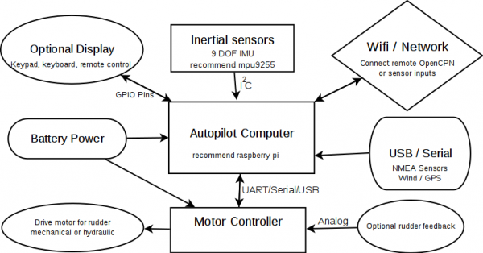

### Motor controller data connection

The motor controller communicates to the autopilot computer with a 4 wire data cable.  The wires carry:

1. 3v3 power
2. tx
3. rx
4. gnd

The connectors from various pypilot products are interchangible, but because the factory has changed the wire colors the function must be determined from the following table.  Each cable is either 1, 2 or 3, depending on which color wires are present.

| 1     | 2     | 3     | purpose |raspberry pin |
| ----- | ----- | ----- | ------- | -----------  |
| Red	| Brown	| Black	| +3.3v	  | 1            |
| Green	| White	| Brown	| tx	  | 8            |
| Blue	| Blue	| Green	| rx	  | 10           |
| Black	| Black	| Blue	| 0v, GND | 6, 9         |

The 3v3 power is used only to power the optical transmitter/receiver on the motor controller and only carries a few milliamps.   The baud rate is 38400 and low enough that very long wires can generally be used between the motor controller and computer at least 100ft unless there is significant interference from other nearby wires, but it should be possible to avoid this.   If you are especially concerned with interference you could use a shielded cable or various other approaches, but this is rarely if ever a concern in practice.   The connection can be extended using phone cable or even ethernet cable for example.

### Power

The autopilot computer receives power via USB-C.  A typical power converter may take 12 or 24 volt power and convert it to the 5 volt power to the raspberry pi requires.  The typical power consumption using a raspberry pi zero is 0.07 Amps with 12 volt input to a converter.  The autopilot computer includes protection circuitry to prevent overvoltage, reverse voltage and short circuits.  The power converter should be mounted away from the autopilot computer to avoid interfering with the compass sensors.

The remote keypads (besides battery powered ones) also need 12/24 volt power to operate and can be simply wired to the same power as the usb power adapter.   The keypad with the "menu" key is intended to be mounted near the autopilot computer.

The motor controllers need power input to drive the motor.  The regular motor controller must only be powered with 12 volts (9-16 volt range) while the mid power and high power motor controllers can be used with 24 volt systems.   Always use o-ring connectors on the motor controller and avoid wrapping bare wires around the screws for long-term reliability.

### USB Data

There is typically a usb port available for optional use to connect a GPS or other sensor such as wind.   It is also possible to connect a usb to nmea converter (recommended pypilot isolated adapter) to interface with nmea0183 sensors or the pypilot_mfd.   It is also common not to use the USB port, or consider it for future use.

### Clutch Output

Some drive systems, especially larger ones may use a clutch output.   This usually either activates a solenoid (hydraulic) or electric clutch to engage a ballscrew (large linear drives)   The clutch output shares the positive power wire with the motor controller, and provides a low output (ground) when the pilot is enabled, or manually commanded to move.   The mid power and high power motor controllers both have clutch output, and the 2 clutch wires would typically be attached to the clutch (far left) and power + connection which is right next to the clutch output.

Typically the clutch outputs full power for 200-300ms, then reduces to a PWM signal to hold the clutch on while minimizing power consumption.  The value of the clutch output duty can be configured with the "servo.clutch_pwm" key.

### Rudder Feedback

<picture of rudder feedback>

First of all, the rudder feedback is optional.   It can be disconnected while underway and pypilot will continue to steer.   It is generally used to avoid relying on stall detection and to report the rudder angle on a display.   It also may be used by certain pilot algorithms to enhance steering, but the basic pilot algorithm does not require it.  To be clear, corrections needed in moderate conditions are 10 or more times that of the errors due to integration from not knowing the rudder position, so the potential improvement in steering performance from rudder feedback is not huge.

The rudder feedback used is connected directly to the motor controller.   This is because it produces an analog voltage (changing voltage) with rudder angle.   If you have an existing rudder feedback that does this, you can safely reuse it however be aware that the acceptable ohm range is 1k to 100k ohms.   The pypilot rudder feedback is fully waterproof and instead uses an angular hall sensor and magnet to provide a changing voltage with angle avoiding wear issues of potentiometers.    The motor controller provides 5 volt power to the rudder feedback sensors on the red and black wires, and the input (changing voltage is received on the yellow wire)

As for the motor controller, there are different combinations of wire codings possible depending on the wire colors present:

| 1      |     2  |     3 | purpose |
| -----  | -----  | ----- | ------- |
| Red    | Brown  | Red   | +5v     |
| Yellow | Blue   | Black | voltage for angle |
| Black  | Yellow | Blue  | GND     |

The connection on the motor controller is labeled "Rudder"  The square pin is GND, the center pin is the feedback voltage pin, and the last pin is 5v power.   You can verify with a voltmeter by measuring the voltage of the pins when the motor controller is powered.

It is not critical that the voltage increases or decreaes with rudder angle as the rudder feedback calibration takes care of the direction.

It is possible to use rudder feedback from the network into pypilot rather than through the motor controller, but the reaction time and and performance is not as good.

### End of Travel Switches

The end of travel switches prevent further movement in each direction when closed.  These are optional, but may be useful on certain drive systems to avoid relying on stall detection as it reduces the loads on the mechanical system.   Closed means the switch wire is shorted to GND.   The pins are labeled "End Stops" on the motor controller, and the GND pin is square.  Some motor controllers provide 5v as well to allow the use of hall sensors, for example a magnet passing near a hall sensor could trigger the switch.  Otherwise some sort of spring is needed on a momentary switch.

### Temperature Sensor

<picture of temperature sensor>

The motor controllers all include onboard temperature sensors, but it is also possible to monitor the temperature of the motor or pump.  To do this attach a 10k NTC sensor to the pins labeled "Motor Temp".   The temperature limit can be configured to protect the drive from overheating, but in practice the motor should never get anywhere near the typical setting of 60C.

## Maintainance

Over time electrical contacts can looses from seasonal temperature changes.  The terminals chooses for the motor controller minimize the issue, but it is a good idea to check them and ensure the terminals are tight after a winter or longer period of time.

Linear actuators used to move the rudder should be stored out of the weather when not in use to prolong their life.   Avoid storing them in areas of the boat that can become very hot and humid such as fully sealed compartments as this can significantly increase corrosion.   It is best to store them below and keep the boat ventilated, the same applies to the electronics.

## Mechanical Installation

### Suggested drive types

#### Tiller-steered boats

<picture of tiller drive>

A basic linear actuator is recommended.  This is a simple solution and easy to mount and remove.  Typically a tillerpilot pin is mounted on the tiller, either by drilling a hole in the tiller itself, or a small block of wood that is hose clamped or attached with lashings to the tiller.   The pin provides a ball-socket type connection to the linear actuator allowing slight rotation in both axes as it moves in and out.  The linear actuator should also be attached to the boat via a pin and bushing to allow slight rotation in both axes as it moves.  This is needed to minimize "play" in the system which will reduce reaction time and efficiency.

<closeup of pin>  <closeup of bushing>

The linear actuator itself can be an existing tiller drive, or one of many available online for low prices, eg:  [gomotorworld](http://gomotorworld.com)   The speed, force and range will vary from boat to boat.    Usually a faster drive is better as it can correct sooner and keep a straighter course which means less overall movement and power consumption.   The force required really depends on the vessel, with unbalanced rudders with significant weather helm requiring many times more force than balanced rudders with balanced sails.

#### Wheel Steering

<picture of wheel steering>

For wheel steered boats it is possible to directly drive the steering wheel using a while drive system.   One example would be a 3d printed toothed pulley bolted to the spokes of the steering wheel driven by  a windshield wiper motor.  The most difficult part of this arrangement is efficient engage and disengage ability to ensure you can easily take over steering again.  Another careful consideration is the alignment of the pulley on the wheel.   A slight misalignment can cause the pulley tension to change as well as skip teeth during rotation.

Typicaly gear ratios used are in the range of 4:1 to 8:1.   A windshield wiper motor usually makes 1 rotation per second, or 1.5 in high-speed mode.

Another consideration is an electric car power steering motor.   These motors are many times more powerful than windshield wiper motor and very durable and efficient.

#### Hydraulic Steering

<picture of hydraulic ram>
<picture of bypass valve>

There are a variety of different hydraulic schematics for different boats depending if there are one or more hydraulic steering wheels or if the wheel is cable driven.   Suffice to say, any type of hydraulic system can be used with pypilot provided an electric hydraulic pump can be used to move the rudder.   If unsure about what size pump, the larger one is recommended both for longevity (less heat) as well as speed of movement.  Having a more powerful pump may save power from faster corrections.

### Speed of Movement

The speed that the motor can move the rudder is one of the most important considerations for a good autopilot experience.   The actual requirement widely varies based on conditions, point of sail, type of rudder and boat and other factors.

As a boat moves faster, the rudder becomes more effective, so although it needs faster corrections, because the rudder is more effective the two factors generally cancel out and the same tuning works well over a wide range of boat speeds.   At very low speeds (drifting conditions) the corrections can be much slower, but this usually has more to do with less dynamic corrections needed (fewer waves or wind gusting) 

As a general rule aim to ensure a minimum of 6-8 seconds for +-30 degree rudder movement.  Many boats have installed slower systems and it is ok to use, but the autopilot performance is directly related to the speed it can move the rudder.   Larger boats do not need to move the rudder as fast as smaller ones.   Light winds, or sailing upwind does not need to move the rudder as fast as strong winds or running downwind.   Rough weather or sailing in wind against currents demands the most speed.

I have put an actuator on my 33ft trimaran which can move the rudder 15-20 degrees per second and I can say I am quite happy with the performance.  Movement of 10 degrees/s would be acceptable as well, but I would not wish for anything slower except in light winds.

As an example on a keel-hung rudder, the speed of rudder movement required for running downwind is much higher than upwind, however the force needed upwind with weather helm is much more than downwind.   In this scenario without having to have two actuators, it may be benefitial to have 2 pins on the tiller at different distances to the rudder hinge for upwind vs downwind.   Similarly in a hydraulic system it may be a consideration to have two pumps and utilize both in rough weather.

In practice few boats take such measures, but it could be worthwhile to explore.  With a balanced rudder the situation is much simpler as the force required is generally very low.  Generally the drive system must be sized for the most difficult conditions, and pypilot can always be tuned to move the motor slower in light winds.

### Clutch/Emergency disengage

It is essential to ensure you can quickly regain manual control if needed.   Systems with an actuator always connected such as larger electromechanical or hydraulic systems often have a clutch output and it is wise to wire a manual switch accessible at the helm to ensure you can at all times take over manual control.   For other systems that manually engage like tiller pilots it is usually easy to lift the actuator off the pin, but a wheel driven system should be carefully designed to ensure manual control is always easy to regain.

### Range of Travel

Typically +- 30 degrees of movement is desired for tacking, but only +- 15-20 degrees needed for holding a course.   At a certain angle most rudders will "stall" at a specific speed and become less effective anyway.  Higher rudder angles may only be rarely useful when docking to act like a brake, or at very low speeds and are typically not useful for the autopilot.

## Remote Controls

### 433mhz wireless remotes

The most common remote control used with pypilot is the 433mhz remote control.  These are commonly used for garage door openers and other applications.  This avoids interference with wifi and bluetooth, but importantly and delivers a consistent reliable signal with low-latency to control the pilot.   There are many low-cost remotes available online, however they do require psk encoding.

<picture of white remote>

There are a few remote controls designs specifically for pypilot that have some important improvements.  First they are fully potted or waterproof.  These designs have keypads intended for autopilot use with +10 +1 -1 -10 buttons.  They send alternating codes and buffer presses to allow rapid key presses without losing codes.  They send stop codes to ensure good timing for manual control.  They support pressing multiple keys (eg: tacking pressing +10 and +1) and can also switch channels to avoid interfering with nearby boats with pypilot (holding +10 and -10 buttons and selecting a channel)   Other remote controls can be much lower cost but do not include these features.

#### 7 key control panel

<picture>
This control panel takes 12/24 volt power and provides standard +10 +1 -1 -10 keys.  The Auto key toggles the pilot enabled on or off.   The menu key enters the [lcd menu interface](#lcd-menu-interface).   The mode key changes to the next available mode.  Because of these functions, this keypad is intended to be mounted near the lcd display of the autopilot computer.   It is possible to reprogram the keys (eg: Auto to engage Menu to disengage) but the other control panel is more suitable for use when the screen is not visible

#### 8 key control panel

<picture>
This control panel also takes 12/24 volt power and provides the standard +10 +1 -1 -10 keys.  Rather than toggling enabled on/off it provides a standby button that always disengages the pilot.  The C, G, W buttons enable the pilot in Compass, GPS, and Wind modes.   Pressing C and G at the same time enters Nav mode, and G and W and the same time enters True Wind mode.

#### 8 key remote panel

<picture>
This is identical in function to the 8 key control panel except rather than taking 12/24 volt power it uses 2xAA batteries making it simple to mount on the boat without running power to it.   The standby current is 4-6uA so typically the batteries should last for several years, but it is recommended to use alkaline batteries regardless.

The remote controls can be configured using a web browser, see [`Configure LCD Keypad and Remotes`](#configure-lcd-keypad-and-remotes)

# Software and Usage

The user manual assumes the use of a separate raspberry pi for running pypilot using the tinypilot system in most cases.   If running pypilot under openplotter or another operating system be aware that some of the documentation is relevant only to that configuration.

## Initial Powerup

### Boot Splash

<picture of splash on running computer>

The initial splash screen is displayed 10-15 seconds after power up.   It indicates the version of pypilot and may be useful in debugging the system.

### led on motor controller

When power is applied to the motor controller, a red led should light indicating power.  There is a green and yellow led which indicate data is recieved and transmitted that typically flash whenever it is communicating with the autopilot computer. Finally a white or blue led indicates the controller is engaged and commanding the motor.

If only a red appears, there is a communication problem.  If yellow or green stays lit constantly, there is likely a shorted connection.

### Power off

pypilot running on the standard autopilot computer utilizing a pi zero typically runs a special distribution of linux called tinypilot.  This is based on tinycore linux and after boot the system runs entirely out of ram.  For thi reason, power can be removed from the autopilot computer at any time without much risk.  It is possible to run tinypilot on various models of raspberry pi, but there is not much reason to use a larger pi as tinypilot is dedicated to running just pypilot and the processing power is sufficient.

For systems running openplotter or other distributions it might be advisable to shutdown in a controlled manner, the system typically will only not boot if the boot partition is corrupted which is usually not mounted, so is rarely an issue even then for losing power, but it is possible to have a switch cleanly shutdown.  For ultimate reliability you could keep a spare sd card ready to boot.

## LCD menu interface

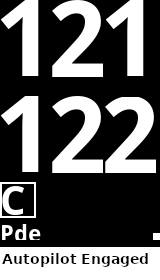

The standard pypilot computer has a COG daylight visible lcd module which displays the current Heading and the desired Course. Below the available modes.

| Key | AP enabled                         | AP disabled               | Function in menu  |
| - | - | - | - |
| -10 | adjust heading command -10 degrees | Manually move rudder fast | Move UP/LEFT Fast |
|  -1 | adjust heading command -1 degree   | Manually move rudder slow | Move UP/LEFT      |
|  +1 | adjust heading command +1 degree   | Manually move rudder slow | Move DOWN/RIGHT   |
| +10 | adjust heading command +10 degrees | Manually move rudder fast | Move DOWN/RIGHT Fast |
| Auto | disable autopilot | enable autopilot | Exit Menu |
| Menu | Enter Menu | Enter Menu | Select, enter submenu |
| Mode | Next Mode | Next Mode | Go to previous menu |

* manual control moves the rudder while the key is held down and stops when it is released.

Another function is tacking which can be initiated by pressing -10 -1 together for port tack and +1 +10 together for starboard tack.

The main menu offers several functions to configure the device

### Gains

  

The gains menu allows for changing the [profile](#profiles) as well as [gains](#gains).  When a new profile is selected all of the gains are updated.

### Calibrate
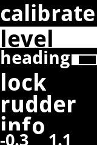

The calibrate menu allows:

- level - select only when the boat is level with the sensor mounted
- heading - adjust the heading offset of the compass
- lock - locking the compass calibration
- rudder - calibrating the rudder feedback.

At the bottom of the screen, pitch and roll values are indicated.  When properly leveled these should read near zero whenthe boat is level.

See [`Calibration Instructions`](#calibration-instructions)

### Settings

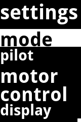

The settings menu includes:

- Mode - Adjust the autopilot mode (useful if the remote/keypad does not have a mode button)
- Pilot - Change the pilot algorithm.  Most users will use the basic pilot

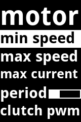 

- Motor - Adjust motor parameters

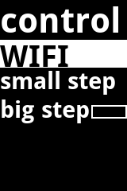

- Control - Adjust wifi settings, and steps for + and - buttons.  If the wifi settings are changed, and you are unable to connect, it is possible to revert back to AP mode using this menu to reconnect to the pilot again.

- Display - Adjust various parameter for the lcd display
- Language - Select the language used for text on the display

### Info

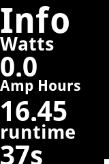 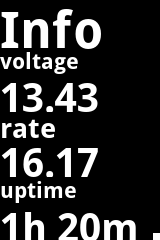 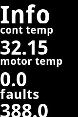 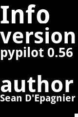

The info screens display basic information about the software, the power consumption and temperature voltage, runtime and rates.   To change the page use the + and - keys.

## pypilot OpenCPN plugin

The pypilot plugin can be used to configure and control the autopilot from within OpenCPN.  It provides special integration and a unique control interface.

### Installing the plugin

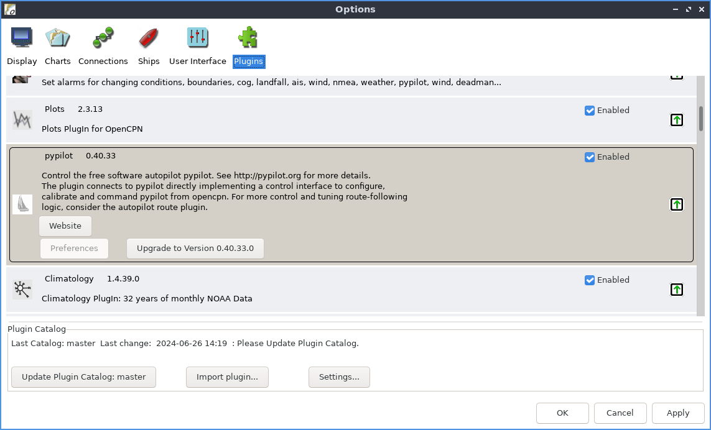
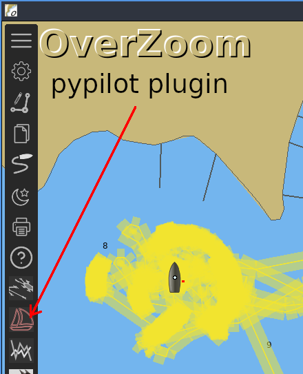

Usually the pypilot plugin can be installed within OpenCPN using the plugin manager.  The latest version of the plugin is 0.51 but older versions generally will work.  It is also possible to build the plugin from source for advanced use.   Coupled with the autopilot route plugin, opencpn steers routes more closely than the builtin route following algorithm.

You might also consider exploring the OpenCPN watchdog plugin which includes pypilot specific alarms.

### pypilot dialog

 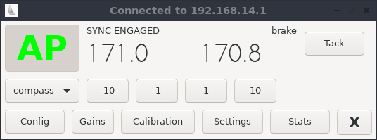

When clicking the toolbar icon, the dialog is displayed.  The basic dialog provides manual control, course changes, mode settings, tacking, and buttons to open additional dialogs.

Along the top the [servo flags](#appendex-a-motor-controller-flags) are displayed.

### gains

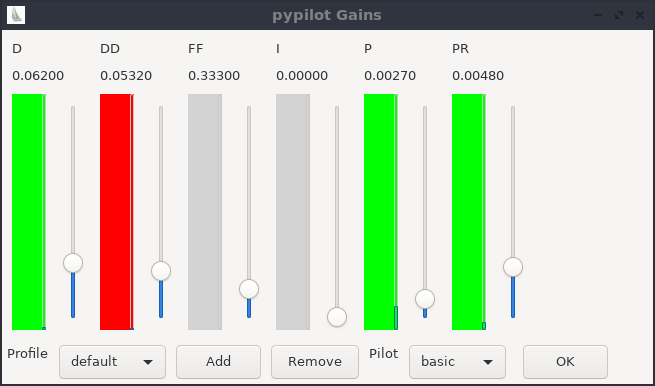

The gains dialog provides means to visualize and adjust gains.  Each gain has a vertical slider to adjust the setting along with an animated indicator showing the current output of that particular gain.   For example, if the gain is red, it is contributing toward a starboard correction, and blue indicates a port.  If the gain is in blue, it has saturated.  This means it is beyond the maximum which is the fastest speed the motor could move.   This usually indicates that the gain is set too high, or the motor is too slow to make sufficient corrections.  See [gains](#gains) for information about adjusting the gains.

Below the gains, the [profile](#profiles) can be set.  profiles can also be added and removed here.   Next is an option to set the pilot.  Most users will use the basic pilot at this time.

### calibration

The calibration dialog can be used to visualize calibration of the autopilot
<todo get screenshots>

### settings

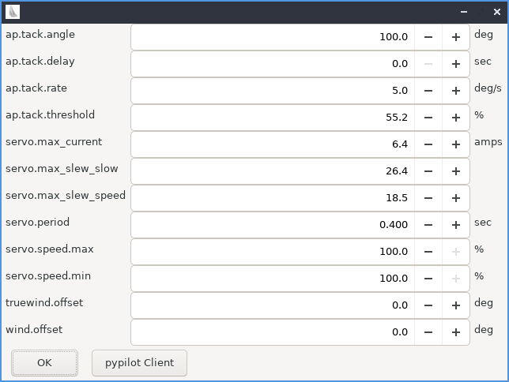

The most common settings users might need to adjust are available from the settings dialog.  Additional settings can be adjusted using the pypilot client.

### stats

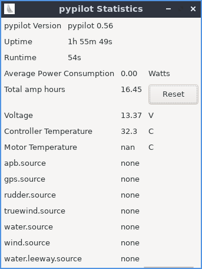

Statistics can be found here, including the software version, runtimes, power consumption, voltage, temperatures, and data sources.

## python scripts

pypilot can also be configured and controlled by python scripts.  These scripts are installed when pypilot is installed, and can also be run on a separate linux system.  For example, if openplotter is networked to a tinypilot system via wifi, you could run these scripts on the openplotter system to control pypilot.  You could also install them on a laptop.

For most linux distributions they can be installed by installing pypilot, eg:
`git clone --depth 1 github.com/pypilot/pypilot
cd pypilot
sudo python3 setup.py install
`
The scripts will attempt to auto-detect pypilot but can also usually be passed the host or ip of the autopilot from the command line.

### pypilot_control

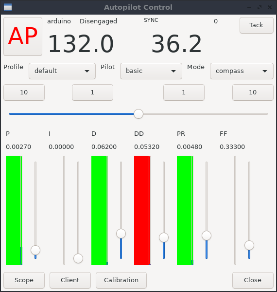

The pypilot_control script is the main script giving control, status as well as gains adjustments.  You can adjust the profile, pilot and mode

Along the top the [servo flags](#appendex-a-motor-controller-flags) are displayed along with the tack button.

### pypilot_scope

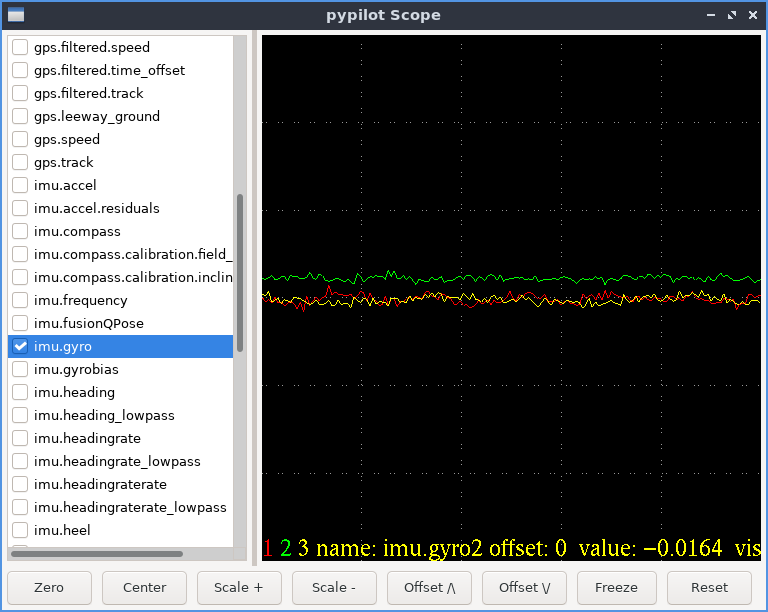

You can run the pypilot scope by executing `pypilot_scope` from the command line.

The pypilot scope provides a graphical display that can plot continuously changing data the autopilot is aware of.

The following keys are supported (you may need to click on the plot first)

- numbers 0,1,2..9  - Select current trace
- +/- - increase/decrease scale
- f - freeze/unfreeze
- p - draw points/lines
- c - center current trace (changes offset)
- C - center all traces
- v - toggle visibility
- V - toggle all visibility
- z - reset trace offset to zero
- Z - reset all trace offsets
- w - toggle fft
- UP/DOWN - move current trace up or down (adjust offset)

Check the fields to monitor, for example imu.gyro will plot the gyros axes.   It may be useful for example to plot ap.heading_error while adjusting the pilot gains underway and see how tuning affects the heading error over time.

### pypilot_calibration

You can run the pypilot calibration by executing `pypilot_calibration` from the command line.

<todo get screenshots>

## Web interface

The pypilot web interface provides a method for controlling the autopilot using a web brower.   This is able to support a wide variety of devices.  The web interface can be accessed from a browser on a device connected to the pilot.   Typically this is http://pypilot.io if the dns resolves, but otherwise the default IP address when pypilot is in AP mode is http://192.168.14.1

The web control interface takes longer to boot than the rest of the pilot.  It has been optimized to get steering available as soon as possible and to delay loading the systems required for the web by a few minutes, so be aware of this if it does not load immediately after booting.

The web control has various tabs at the top of the page described below.

### Control

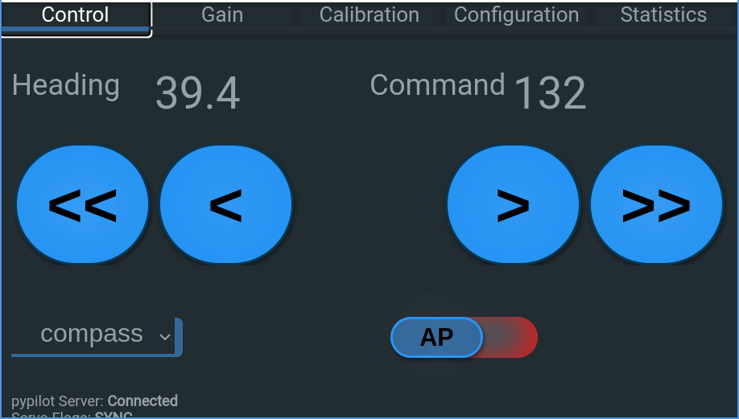

The control page has the main control for pypilot.  The heading and command are displayed at the top, and when the pilot is not enabled, the buttons << < > >> are displayed, and tapping and holding each button will manually move the drive.   If a rudder feedback is installed, an additional button | will be displayed and it can be used to center the helm.

The autopilot mode can be changed with the choice combo dropdown.

Below (on small screens may require scrolling) the ap enable/disable toggle switch is on the lower left.  To toggle, simply tap this switch (do not need to slide)   On the lower right, the tack button can be found to tack the boat.   Some other statistics and information is also displayed.

### Gain

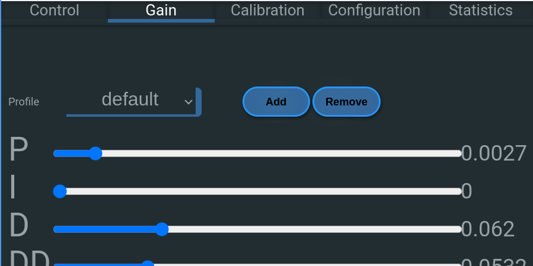

This page allows changing the profile which will adjust all of the gains (and server parameters) along with the actual gains.   On mobile devices << < > >> buttons can be tapped where on desktop a slider is provided.  See [Tuning Gains](#gains) for the actual adjustments

### Calibration

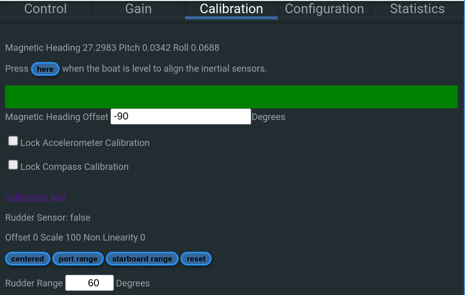

The calibration page is essential to calibrating the pilot for correct operation.  The web interface provides a button to level.

There is a text area for compass offset, and boxes to lock the calibrations

A separate link to the calibration plot (useful for accelerometer and compass calibration)

Finally the rudder feedback can be calibrated by tapping the appropriate buttons and entering the rudder range.

See [`Calibration Instructions`](#calibration-instructions)

### Configuration

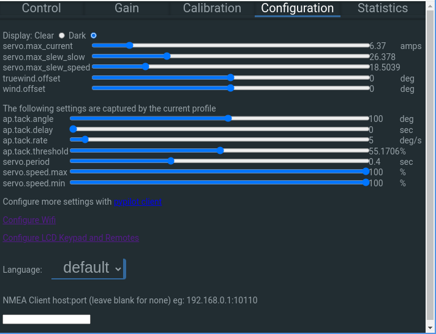

The configuration page allows selecting "Clear" or "Dark" theme which only affects the display in the web interface.

Next, some important parameters can be set.  These are broken into 2 lists, the first are global parameters, while the second set has settings that like the gains are connected to the current profile and will be updated if the profile is changed.  see [`Configuring Parameters`](#configuring-parameters)

Below this there is a link to the pypilot client which allows viewing and adjustment of all possible parameters.

Next are links to [`Configure Wifi`](#configure-wifi) and [`Configure LCD Keypad and Remotes`](#configure-lcd-keypad-and-remotes)

#### Language

The language may be detected automatically for the system running the web browser however this could be undesirable or annoying.  You can manually override the language here.

#### NMEA Client host:port

Some nmea routers or systems cannot connect to pypilot, and instead need pypilot to connect to them as a client.   If this is the case you can put the host or ip address : port to use in this box.   Normally it should be left blank

### Statistics

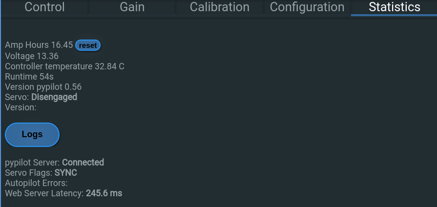
The statistics page on the web interface shows basic stats on power consumption and use.

## Configure Wifi

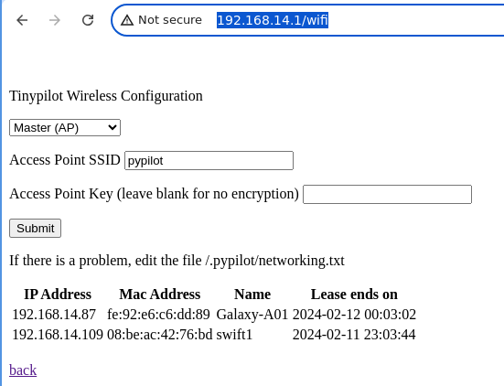

A link is provided to configure wifi from the Configuration tab of the web control.  By default you can access this with http://192.168.14.1/wifi or in a browser using the ip the autopilot computer is using.  This applies only to tinypilot systems.  If you are using openplotter or other operating system refer to their instructions for configuring wireless networks.

The autopilot computer can be configured as a wifi client, or AP+client (where it acts as an access point as well as a client) or AP mode.   By default it is in AP mode and wireless clients can connect to it.  You may wish to switch it to client mode to integrate it with an existing wifi network, however be aware that if you do not know the address of the client once it connects it could be difficult to access.   For this reason the AP+Client mode may be useful as it still provides the access point.

It is reported that this mode is somewhat unreliable though, meaning that the AP+Client mode is probably only good for accessing the device if the the client cannot be found.   It is also possible to revert to AP mode via the lcd menu interface, editing the networking file on the sd card, or reimaging the sd card.   Please be aware of the limitations and it is recommended to have access to the lcd menu interface in case the wifi client fails to connect.

If it does, connect you may wish to assign a static ip, or access your router to find the ip assigned to the autopilot.   It is usually possible to discover pypilot with another machine on the same network as well using [`pypilot client`](#pypilot-client)  Another option is to run the "nmap" command to discover the address assigned.

A list of connected clients will be displayed in a table.

## Configure LCD Keypad and Remotes

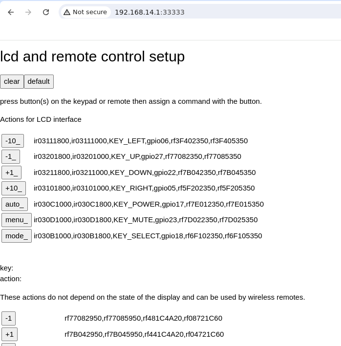

The LCD Keypad and Remotes can be configured via the web interface.  There is a link to this page from the Configuration tab of the web control, or typically it can be accessed via: http://192.168.14.1:33333

### programming remote control/keypad

There are many different functions that can be assigned to a particular key.  These keys can be remote control panels, or even IR remote controls.  Functions can also be assigned to gpio pins here (used by pypilot hat) including pressing multiple keys at the same time.

The pypilot control panels use alternating codes (for better reliability of presses) so each function must be programmed twice, however they can typically be automatically programmed if detected.

The first 7 functions are tied to the lcd interface.  In essence, their function depends on the state of the display, intended to use with a remote near the screen.  Using them without being able to see the screen is not advised.  Their functions are described [here](#lcd-menu-interface)

Below these, there are additional functions that can be used which do not consider the display and should be used for hand held remote or controls mounted anywhere on the boat.

### analog inputs

As of this writing the analog inputs are not fully supported, but allow additional readings for example joystick control

### IR (infared receiver port)

The IR port receives signals from infared remote controls.   Both the raspberry pi and the onboard arduino are capable of decoding them, but some versions of software the raspberry pi will not decode them properly, and it is difficult to program new remote control codes.  For this reason, the arduino may be preferable.  If you have trouble programming an IR remote, try both options.

### hat NMEA port

The hat NMEA port is available on pypilot hat provides isolated rs422 data port for nmea0183 input and output.  This port can be configured to enable/disable input and output and set the baud rate used.

### Remote Mode

It is possible to use additional pypilot computers as control heads or displays for the main autopilot computer.   These can work over wifi, but if multiple computers have remote control receivers it is essential to ensure that only the main computer is programmed to receive from the remote.   A second pypilot computer could be mounted in a different location providing the lcd display, and it could also function as a backup autopilot by turning off remote mode and connecting the motor controller output to it if needed.

At the bottom, some statistics including the 5v and 3v3 voltages are displayed

## Calibration Instructions

Calibration can be performed from any of the control interfaces but it is recommended to open the calibration plot in either the [Web Interface](#web-interface) [pypilot OpenCPN plugin](#pypilot-opencpn-plugin) or the [pypilot_calibration](#pypilot_calibration) script.

Once calibrated pypilot is ready to use.

### Accelerometer Calibration

Most recent pilots include the icm20948 sensors which are factory calibrated for accelerometer however many do still have small biases that can be compensated for.  It is not required to compensate for the small difference but it can improve the accuracy of the compass by at least a few degrees.   To calibrate the accelerometers they will have to be unmounted from the boat so then can be rotated in various orientations.   Typically tinypilot computers are shipped with the accelerometers already calibrated, but if you have re-imaged the SD card it is a good idea to perform this step.

Ensure the accelerometer calibration is not locked, and carefully hold the sensors so that each of the 6 sides of the box is facing downward toward the earth in turn.  Once this is performed, every 30 seconds a calibration update may be attempted.  If there is sufficient difference the calibration parameters will be updated and reflected on the calibration display page, if not an output message in the calibration log should indicate the reason.

To calibrate the accelerometer bias, you must be on a “mostly” stable platform. It may be impossible to do at anchor if the boat is moving too much, so either in flat water, or land for this step.  Leave the sensors in each position for a few seconds.

Once a calibration is applied the accelerometer calibration age should reset. If it does not, repeat the process putting the sensors in different orientations until a calibration fix is found.

### Leveling (Alignment)

If the accelerometer are calibrated, the sensors can be fixed to the boat.   The level button should only be pressed when the boat is sitting level and not moving.  If it is pressed at the wrong time, you can always try again when the boat is sitting level.   A progress bar will indicate the period of time as the sensor readings are averaged for the alignment computation.  Once leveled, the pitch and roll readings should be nearly zero.   Leveling is essential to ensure the autopilot can read the correct heading.

Correct alignment calibration must be performed before the compass calibration can begin.

### Compass Calibration

Be sure to locate the sensors away from:

magnets - speakers and especially moving magnets like a floating compasses
current carrying wires - very simple rule is 2 cm (1 inch) for every amp
iron and steel - less critical, so if you are in a steel boat, just don't fix the sensors to a steel wall, but try to locate them several inches at least offset from it.
The compass calibration is mostly automatic. If the accelerometer and alignment are calibrated, you just need to sail turning more than 240 degrees to calibrate the compass.

Make sure the calibration is not locked or updates will not occur.   It may be useful to lock the calibration to prevent updates while underway in case of rough seas.

There are both 2D and 3D compass calibration fixes. A 2D fix will occur from turning without pitching or heeling. When heeling there may be some error without a 3D fix. To obtain a 3D fix, you should make a circle with sufficient heeling, such as tacking against the wind, or rolling in waves.

Another way to achieve a 3D fix is to unmount the sensors and manually rotate them including some pitch and roll to achieve a fix.  Once a 3D fix is achieved, the sensors can be mounted to the boat.  Now re-level the sensors and rotate the boat through 360.   If a 2D fix is achieved, the bias bias from the previous 3D fix will be used.   If using this method try to keep the sensors away from metal but near the location they will be mounted.

Subsequent 2D fixes will use the previous undetermined value for 3D fix, combining the new 2D fix with the past information from a 3D fix. Performing an initial accelerometer calibrationand a quick manual rotation will give a rough 3D fix in most cases making a subsequent 2D fix sufficient for most use.

Compass calibration is continuous and always updates unless locked. You may wish to lock it to prevent future calibration updates.

If the sensors are remounted, they must be re-aligned and the compass recalibrated.

If metal objects are moved around the sensors, the compass must recalibrate.  Moving metal obects near the sensors underway can cause unexpected maneuvers including uncontrolled jibes.

### Heading Offset

Once the compass is calibrated a heading offset can be entered depending on the orientation that the sensors are mounted in the boat.   Without this, the pilot can still hold a course, but the heading displayed will not match the actual course.   This corrects this offset as well as ensures the pitch and roll readings are correct.  For example if the heading offset is off by 90 degrees, the pitch and roll readings may be reversed.

### Rudder

If a rudder feedback sensor is installed you can check the rudder calibration page to read the value and ensure it is working.   To calibrate the rudder, you must manually turn the helm to the port range, starboard range, and center and press each button for each position.   The order is not important, but once all 3 are completed the scale, offset and non-linearity should be computed.   The "rudder range" field should be manually set to indicate the true angle at each range position and to limit autopilot movement past this position.

Note:  It is possible to set the "rudder range" to say 35 degrees, and calibrate the rudder by moving it to 35 degrees in each direction, and later set it to 30 degrees to further constrain the range the autopilot can move the rudder.   So to be clear, the "rudder range" is for calibration and whatever the value is when the button is pressed, but in operation it specifies the maximum angle the motor controller can move the rudder to.

## Configuring Parameters

### Servo parameters

There are various parameters that affect the control and operation of the autopilot.

####  servo.max_current

The first parameter to adjust is the servo.max_current.    This sets the stall detection for the drive.   If it is set too low, overcurrent errors will constantly appear and the drive will not move, but if set too high the drive could continue sending power when the drive is stalled.   For typical tiller pilots a range of 4-7 amps is usually correct, and for hydraulic or larger drives higher values such as 15-20 amps should be used.

#### servo.slew_speed servo.slew_slow

These are essentially the maximum acceleration/deceleration of the drive.   Limiting acceleration gives a smoother movement with less current spikes (allowing a lower max current setting) but if the value is too low, the reaction time will be limited.   Typically values of 15-30 should be used.

#### servo.period

The servo period is the minimum amount of time that the motor can move or rest.  Essentially it prevents the motor from making too many short movements.   Short movements can give faster corrections and better steering, but at the expense of wear and power consumption.   Typical values of 0.3 or 0.4 work well for most boats in most conditions, but larger/slower boats or lighter conditions can use higher values, and smaller/faster boats or rough conditions can consider smaller values.

#### servo.speed.min

This value limits the minimum speed the motor can move.   This is useful because many electric motors become less efficient the slower they are turning in the autopilot application because of significant friction.   For this reason it is typically better to make short fast corrections and spend most of the time not moving the rudder.   Setting a minimum speed ensures that the motor will either move at this speed or remain stopped.

#### servo.speed.max

This limits the maximum speed of the motor.   It may be useful in lighter conditions to slow down the rudder movement to reduce noise or wear.    Usually the faster the drive motor, the better the performance, but if conditions are light you can simply limit the drive speed by reducing this value. 

#### servo.use_brake

When the servo brake is enabled, the motor controller will essentially short the motor when engaged and holding course.   This can prevent the rudder from backdriving the motor when there is significant weather helm.   It is most useful on monohulls with unbalanced (keel hung) rudders sailing upwind.   For other users, it may be preferable not to have a brake because it allows you to backdrive the motor (dodge objects in the water) quickly without disengaging the pilot or drive.

### Gains

The basic autopilot uses an enhanced PID filter to form a feedback loop. Various gains can be adjusted to improve performance and vary depending on the boat, seastate, and rudder drive motor.

The gains are as follows:

- P - proportional - heading error
- I - integral - based on the accumulated error
- D - derivative - rate of turn
- DD - derivative' - rate of rate of turn
- PR - proportional root - square root of heading error
- FF - feed forward - change in heading command

It is recommended to use the [opencpn plugin](#pypilot-opencpn-plugin), or [pypilot_control](#pypilot_control) for tuning the gains because visual feedback is provided.

To get started retuning from scratch (or on a new boat) set all of the gains to zero, except the P and D gains. It is possible to have a fully usable (but less efficient) autopilot using only these two gains.

Set the P gain to a low value (say .003) and the D gain to .01. Typically on larger boats, you will need higher values, but this is typically because they have slower motors installed to move their rudders.  It really depends on how fast the drive motor turns the rudder and the conditions.

The hard over time is how long it takes to turn the rudder from end stop to end stop. This is typically 30 degrees for each side. If a smaller motor is geared down more, and takes, say 16 seconds, then these gains should be doubled to P=.006 and D = .02 as a starting point.

If the boat takes too long to correct the course and spends a long time to one side of the correct heading, increase these two gains. If the motor is working too hard, and frequently crosses the correct heading, decrease these gains.

- P - proportional gain - This value should normally be set low. If it is set too high, the boat will constantly turn across the desired heading. If it is too low, the boat may fail to maintain course. As it is increased a higher D gain is needed to compensate (prevent overshoot)

- D - derivative gain - This is the gyro gain, and the main driving gain of the autopilot. Most of the corrections should be as a result of this gain. Once the best value is found it can typically work in a range of conditions, however, in light air, it can be reduced (along with reducing other gains) to significantly reduce power consumption especially if the boat is well balanced.

- PR - proportional root gain - This gain can be really useful preventing oscillation especially upwind. To use it, increase it until it takes effect, and gradually back off on the P gain. You will still need some P gain, but it may be less than half of before if a sufficient PR gain is used.  The 1/2 derivative of a linear function is actually 2*sqrt.  So in a sense this gain minics the fractional derivative PID filter by providing a useful fractional component to mix into the correction.   It helps to produce a dampened response as it is often not better to linearly scale feedback with heading error as it can produce overshoot.  I generally set this gain to 1-2x the P gain, which allows for a lower P gain and reduces overshoot.

- DD - derivative' gain - This gain is useful to improve reaction time. It can allow for corrections sooner than they would occur from the D gain alone. To use it, gradually increase this value up to 1.5x the D gain value without changing other gains, and compare the results.

- FF - feed forward gain - This gain is only useful when making course changes. For holding heading it has no effect. Following a route can cause course changes and this gain will be applied.  It can be very useful in improving the response time since a low P value is normally desirable, large course adjustments can take a long time to respond without the FF gain.  This gain has the main initial contribution when the course is adjusted.

- I - integral gain - This gain does not need to be used to hold a course, however it can compensate if the actual course held is different from the commanded course. If following routes, and the boat tends to follow along a line parallel to the route, this will compensate for that error. It is best to start at zero, and very carefully increase it until the results are improved.  If the value is too high, it will simply increase power consumption.  Most users can use a value of 0 for this gain (disabling it) with good results

#### Hints

upwind - less D gain, more P (or PR) gain downwind - more D gain, and possibly add DD gain light wind - less gains - save power strong wind - more gains - needed to operate correctly

For sailing in protected waters, steering a less straight course is a tuning error, and will only increase power consumption.

If you can tolerate less straight steering it may save power in waves. Generally you just want to keep the sails pulling, and the average course that you desire. This was always the goal with a mechanical wind vane, and can save power consumption as well as wear on the autopilot drive motor.

#### Explanation

The units may seem arbitrary, but to clarify, the P gain, a value of 0.003 means to move the rudder at 0.3% of its maximum speed for each degree of heading error.   So if the boat is off course by 10 degrees, it would move the actuator at 0.3% of maximum speed on average.  Since it moves in bursts, it might make a slight correction for 0.3 seconds every 10 seconds.  The P gain usually contributes a small fraction of the overall correction though, but combined with the PR gain (which is usually a bit higher) the effect is enough to hold course.   By comparison, the D gain, with a value of 0.06 means the rudder would be commanded to move 6% of the maximum speed on average for each degree per second the boat is yawing.  So if the boat is yawing at 5 degrees per second, this could translate into moving the rudder at full speed 30% of the time (depending on the servo speed limits)   The other gains are computed similarly.

### Profiles

pypilot supports different profiles to quickly change the settings that are normally adjusted based on the conditions.   These include all of the gains as well as many servo and tack settings.   The advantage is that if you tune the boat to particular conditions, you can create a profile, then change to it in the future when sailing in the same conditions, but remembering the settings for a variety of conditions to improve handling, power consumption and even noise.

For example, in light winds, it might be preferable to reduce the servo.speed.max to less than 100% to reduce the noise the motor makes.   Since the power consumption is already minimal in light winds, although most drives are less efficient below maximum speed overall, this could be a useful compromise to have a quiet autopilot.   Similarly in rough weather it might make sense to ensure both servo.speed.min and servo.speed.max are at 100% for optimal handling and power consumption.

Another example would be to reduce the gains especially P gain sailing upwind as many boats naturally balance.   This is because on typical sailing rigs, as a boat falls off the wind, the force excerted by the rig on the hull increases and all of the forward force is on the leeward side of the boat causing it to round up into the wind.  Similarly as the boat points too close into the wind, the sails begin to "stall" reducing their force on the hull causing the boat to fall off.   For this reason many boats can have the rudder locked upwind and maintain a useful course, however an autopilot is usually benefitial especialy in waves to minimize and dampen this oscillating effect and improve overall speed.   For this reason, a higher D gain and lower P gain can be used upwind, and a separate profile could be considered for this.

### Additional Settings

## Operation

### enable/disable

The most basic operation is to enable/disable the autopilot.   This can be done using the chosen control interface.   Once enabled, the motor controller should light up blue or white indicating it is commanding the motor.   The lcd display no longer shows "standby" but the commanded course.  When disabled, manual control is possible to move the rudder using the buttons or control input, when enabled, the same interface instead adjusts the commanded heading.

When enabled the commanded heading is reset to the current course.

### Modes

The autopilot supports various modes for holding a course

#### Compass

Compass mode is the most basic mode and should always be supported because of the internal compass sensors.   Other modes may fall-back onto compass mode if data is unavailable, and it provides a means of holding the boat facing a particular magnetic heading.  When starting to use the pilot it is best to try this mode and ensure it is working correctly, because other modes typically rely on the compass to work correctly as well.

#### GPS

GPS mode uses the gps heading to adjust the underlying orientation of the boat.   This keeps the boat moving in a particular direction relative to true north.  This may not be the direction the boat is facing (leeway and currents) but it can be useful to ensure the boat is traveling in a particular direction relative to the ground.   If the compass has significant variations this mode can somewhat help to compensate, but because of the low output rate of most GPS, the compass and gyros are still used to correct the boat motion, and the GPS is used at a slower rate to ensure these corrections keep the boat moving in the right direction.

#### NAV

NAV mode is very similar to GPS mode except that if an external plotter such as OpenCPN is sending autopilot bearing messages (APB) to the pilot, it will adjust the heading command to follow them.   This allows for steering to routes.   It may be useful to note that if this mode appears as available then the pilot is receiving such messages, but you can also switch to a different mode to ignore them.

#### Wind

Wind mode uses the apparent wind from wind sensors.   This will keep the boat facing in a particular angle relative to the apparent wind.   It is possible to tune and dampen the wind sensors if they are noisy, but in general this mode is most useful when sailing close to the wind and with shifting winds.

#### True Wind

True Wind mode combines apparent wind from wind sensors and water speed (or gps speed if there is no water speed) to compute the true wind over water (or ground)   The pilot then steers to this angle.   It is most useful when running downwind as sudden accelerations can greatly affect the apparent wind.   This helps to compensate this effect and keep the boat sailing in a more straight direction.

### Tacking

The tacking function makes it simpler to tack the boat while under autopilot.  When using the remote controls, generally There are various tacking parameters:

#### ap.tack.delay

This value is simply how long pypilot will wait from when the tack is commanded before initiating the tacking routine.   It may be useful to allow the user to prepare to release the sheet at the right time.  On smaller boats it may be simpler to use a value of 0 (no delay)

#### ap.tack.angle

This is simply the angle to tack.   Typical values are 90-120, but it may vary depending on the boat, wind speed and sea state.   In wind mode, the current angle will be reflected rather than using this value.

#### tack.rate

This is the speed to turn the boat through the tack in degrees per second.   Typically you might just set this high, and the boat will tack as fast as possible (rudder moves to limit quickly)

#### tack.threshold

This value sets the point at which the tack is considered complete.   For example, a threshold of 100% will likely overshoot as the boat will not stop tacking until it reaches the target.   A value of 50% will initiate holding the new course when the boat is directly facing the wind which is typically a good starting value (since the boat is already turning)   For boats with quick responses with small waves, even lower values may be useful to prevent overshooting the tack.

In summary, too high of a threshold tends to overshoot the tack, while too low of a threshold can undershoot (boat fails to tack or tacks too slowly)

### Pilots

pypilot supports various pilot algorithms.  The basic pilot is by far the most widely used and proven pilot which uses an extended PID filter to incorporate square root and second order feedback.   Other pilots may have different capabilities, such as ignoring the compass sensors entirely, or utilizing the rudder feedback directly in the control loop.   These pilots may need to fall back onto the basic pilot if their required inputs are unavailable so it is essential to ensure performance is adequate using the basic pilot.

## Supported Data Formats

### NMEA0183

This is the most universal marine standard and the following sentences can be received:
- MWV - apparent and true wind
- VWR - apparent wind (alternative legacy)
- VWT - true wind (alternative legacy)
- APB - autopilot bearing for route following
- VWH - water speed
- LWY - leeway
- RMC - gps
- RSA - rudder angle (prefered to use a rudder sensor directly to the motor controller)

The following sentences can be output
- MWV - after calibrated
- RSA - rudder angle
- RMC - if gps filter combines IMU and GPS data this can provide a high speed output for speed/track
- XDR - pitch and roll
- HDM - magnetic heading
- ROT - rotation rate

The nmea0183 connections are either on serial ports, usb ports, or via wifi.   If the connection is a serial port or virtual comm port, it will be detected with a baud rate of 4800 or 38400.   Sentences received over usb/serial not used by the autopilot will be relayed to devices connected to wifi.

The wifi connection for nmea0183 data listens on port 20220.

It is possible to simply make a connection to this port in a program like OpenCPN, however the pypilot OpenCPN plugin has an option to autodetect pypilot and automatically make the connection and if enabled, a duplicate connection should not be made.

It is possible to monitor the nmea sentences simply using netcat, eg:
`nc 192.168.14.1 20220`

It is also possible to configure a [nmea client](#nmea-client-hostport)

Normally data received via wifi is not relayed to other wifi connections though it is possible to override this by sending a `$PYPBS*48` message to the connection.

### SignalK

SignalK is an alternate open marine data format.  It generally relies on an instance of the  signalk-node-server to distribute data.  pypilot can detect this server on the network automatically and begin to receive data from it for things like wind or gps, however for pypilot to be able to send data to signalk it must be granted access.  If you are running openplotter, the signalk server is normally enabled.  Connect to the signalk server in a browser, eg  http://10.10.10.1:3000   Login with administrator privileges, and look for "Access Requests" on the left menu.  If pypilot is able it will request access, and if granted read/write access, pypilot will be able to send data to the signak server.

The following signalk keys are supported:

- environment.wind.speedApparent - apparent wind speed
- environment.wind.angleApparent - apparent wind angle
- environment.wind.speedTrue - true wind speed
- environment.wind.angleTrue - true wind angle
- navigation.courseOverGroundTrue - gps course
- navigation.speedOverGround - gps speed
- navigation.position - gps position
- steering.rudderAngle - rudder angle
- steering.autopilot.target.headingTrue - autopilot target heading
- navigation.headingMagnetic - compass heading
- navigation.attitude - pitch roll and yaw
- navigation.rateOfTurn - rate of turn
- navigation.speedThroughWater - water speed
- navigation.leewayAngle - leeway

## Advanced Usage

This section describes some more advanced features generally not required for normal use.

### SSH access

The autopilot computer can be accessed via SSH.  The normal tinypilot login username is "tc" with a password of "pypilot"  eg:

`ssh tc@192.168.14.1`
`password: pypilot`
`$`

Once the shell is accessed it is possible to run various commands directly on the shell

### Viewing log files

The log files can be accessed from the web interface eg:
http://192.168.14.1/logs

but also via the shell
$ cd /var/log/
$ ls

Each service has a directory, in that folder the latest log is "current" eg:
`cd /var/log/pypilot/current`
`cat current`

You can also retrieve the log files remotely using scp
`scp tc@192.168.14.1:/var/log/pypilot/current .`

### pypilot Client

the pypilot_client allows status and control of the autopilot using a simple command-line tool.  This tool along with others may be installed on most linux distributions by installing the  [`python scripts`](#python-scripts)

Without parameters, all the possible pypilot values are listed.

If a parameter is passed as an argument it can be read or set for example, to enable the autopilot execute:

`pypilot_client ap.enabled=true`

The following command line switches are supported
- -c continuous monitoring
- -i produce verbose output for the particular value
- -h print information message

There is also a graphical implementation of the client that can be executed with `pypilot_scope_wx`  The graphical pypilot client functionality is also built into the web interface as well as the opencpn pypilot plugin.

### Logging Data

It is possible to monitor and log autopilot data using the commandline tool `pypilot_client`

For example to view the gyros issue:
`pypilot_client -c imu.gyro`

The output can be redirected to a file to store it, eg:
`pypilot_client -c rudder.angle > rudder_log`

### rebuilding software

For most users it may be best to re-image the sdcard to upgrade pypilot software because it ensures that the entire system is in a known updated state including all the dependencies.  It is possible instead to only update the pypilot package and rebuild it on the autopilot computer.   To do this connect to the autopilot computer via ssh:
`ssh tc@pypilot.io`
`cd pypilot`
`git pull username@remote:pypilot`
`. pypilot.build`
`reboot`

Before running this script ensure pypilot is fully booted, eg: `cat /tmp/bootlocal.log` has "done"

Often you cannot pull directly from github on the tinypilot because of the security support, so pulling from a machine on the local network is needed.   If these commands are executed the system will update pypilot.  It is essential to perform this step if modifying source code.

You can also test changes without a rebuild by first stopping pypilot, and running it directly
`sudo sv d pypilot`
`cd pypilot/pypilot`
`python3 autopilot.py`

This is a faster way to test new changes and when verified building the package will ensure the changes are used on reboot.

If you edit startup scripts, for example in /opt the changes will not be stored to the sdcard on reboot unless the command `filetool.sh -b` is executed.

### enabling additonal/custom pilot algorithms

In the pypilot/pypilot/pilots folder there are several pilots that are disabled by default.  Editing the python file to comment out the `disabled = True` line, and rebuilding or restarting pypilot will enable them for testing.

### pypilot data format

pypilot has it's own data format used internally but also to communicate with remote programs.  For example the OpenCPN pypilot plugin communicates using this format.   The tcp port used is 23322 and the format is a simple key=value for assigning or retrieving data.  To get or watch a particular key you would send `watch={"key":0}`  or replace 0 with the period.

## Upgrading Software

Software can be updated via ssh for development purposes, but the most reliable way to update software is by imaging the sd card. It is recommended to use a new sd card keeping the old one until the new software is verified and working in case you need to switch it back.

The image can be downloaded from pypilot.org/downloads and instructions for updating the image are found there.

# Technical and Support

## Design Decisions

### Type of Sensors

The icm20948 is a successor to the mpu9255.   These sensors are proven to have adequate data for inertial navigation.   The main advantage I have found in the icm20948 is better quality control compared to the mpu9255, but the sensors themselves are similar in performance.

One of the most important features is the use of hall sensors for compassing compared to magnetoresistive sensors.   Hall sensors are not nearly as sensitive but are much more repeatable.  They are senstive enough for compassing and the repeatability is more important than the sensitiivty.

### Software Design

pypilot is written in python.  This language is not the fastest or most efficient, not the easiest to integrate with certain interfaces, nor is it capabile of expressing algorithms in the most elegant way.   What it can do is provide a safe language that tends to throw understandable exceptions, is relatively easy for a lot of people to understand and modify, and provide good integration to math, scientific and other libraries.  The more performance critical pieces of pypilot are implemented in c++ and called from python.

The advantages to python include the ability to rapidly develop the program without waiting on recompiling and avoid unexplained crashes while still having sufficient performance to run on modern low-cost processors.

The software itself utilizes multiprocessing.   This can take advantage of multiple core processors but more importantly separates the logic of the autopilot into separate programs that communicate with eachother and can be scheduled with different priorities.   For example, the main control loops and inertial sensors have realtime priority to ensure good performance while the data manipulation are more relaxed and can run with normal process and calibration routines can use idle or spare cpu time.

### Hardware Design

The autopilot motor controller is kept separate from the computer for reliability and to ensure a modular design.

## Mechanical Description

### pypilot computer

- Enclosure size 85x58x33mm
- ABS plastic
- Overall length with mounting tabs and waterproof glands: 115x85mm
- 3x PG7 glands for motor controller, usb power, usb power output
- 433mhz wire antenna for receiver

### motor controllers

Dimensions of printed circuit boards
- pypilot motor controller 77x51mm
- midpower motor controller 104x72mm
- highpower motor controller 116x87mm

### motor controllers 3D printed enclosures

### rudder feedback

<picture of rudder feedback>
The rudder feedback unit consists of a 3d printed body which has delrin bushings.  A stainless shaft rotates through these bushings with a smooth fit.  The end of the shaft has a diametrically magnetized magnet which sits just above a potted angular hall sensor (mlx90316) ensuring the entire design is waterproof and has no potential to wear out over time.  Attached is a lever arm which should be mechanically actuated by the rudder.   Typically there is a ball socket on the end of the lever arm attached to the quadrant.  The longer the lever arm, the less play affects the rudder feedback.

## Technical Specifications

### Power Specifications

| Product | Voltage | Idle Current | Idle Power | Max Current |
| - | - | - | - | - | - |
| pypilot computer | USB-C (5v) | 180mA | 850mW | 280mA |
| pypilot motor controller | 9-16v | 5mA | 60mW | 7A |
| mid power motor controller | 9-32v | 2mA | 24mW | 15A |
| high power motor controller | 9-32v | 2mA | 24mW | 30A |
| pypilot rudder feedback | 5v | 14mA | 67mW | 14mA |
| control panel | 9-40v | 3.5mA | 42mW | 20mA |
| rs422 usb isolator | 5v | ... | ... | ... |

One of the most likely components to fail over time are electrolytic capacitors because they can dry out over time especially with heat.   For this reason I have selected capacitors of the 63V rating even for 12 volt systems because the larger physical size ensures they dissipate heat and operate at a lower temperature.  Furthermore the higher voltage capacitors tend to have a longer life.

## fuse and internal resistance

| Product | Fuse | Internal Resistance |
| - | - | - |
| pypilot motor controller   | 10A | <50mΩ |
| midpower motor controller  | 20A | <35mΩ |
| highpower motor controller | 30A | <20mΩ |

## Additional Support

### Raising issues on github

For significant software bugs it is acceptable to raise an issue on [github](https://github.com/pypilot/pypilot/issues)  Please do not raise issues for feature requests or questions for how to use the software.

### openmarine forum

The [openmarine forum](https://forum.openmarine.net/forumdisplay.php?fid=18) is the preferred way to discuss pypilot.  As it is a public forum, other users can help eachother, and the discussions can be searched in the future.  It this both for troubleshooting and issues, but there is a separate forum for [feature requests](https://forum.openmarine.net/forumdisplay.php?fid=21) and another for [posting ads](https://forum.openmarine.net/forumdisplay.php?fid=25) to buy and sell used pypilot hardware.

### Contact Author

The author can be contacted via email to discuss pypilot.  It is best to include pypilot in the subject line to avoid spam filters.   The contact information can be found on pypilot.org

# Appendex A - Motor controller flags

- SYNC - the computer and motor controller are communicating
- OVERTEMP_FAULT  - either the motor controller or motor have exceeded the temperater limits
- OVERCURRENT_FAULT - the stall protection has been triggered
- ENGAGED - the controller is receiving commands from the computer to control the rudder
- INVALID - the controller has received invalid data, this indicates a data problem
- PORT_PIN_FAULT - the end of travel switch for port movement is triggered
- STARBOARD_PIN_FAULT - the end of travel switch for starboard movement is triggered
- BADVOLTAGE_FAULT - the voltage the motor countroller is reading is outside the correct range
- MIN_RUDDER_FAULT - the rudder feedback reached the minimum value
- MAX_RUDDER_FAULT - the rudder feedback reached the maximum value 
- BAD_FUSES - the motor controller fuses are not programmed correctly
- PORT_OVERCURRENT_FAULT - indicates the overcurrent was triggered while moving to port, and the motor will not move further in that direction
- STARBOARD_OVERCURRENT_FAULT - indicates the overcurrent was triggered while moving to starboard, and the motor will not move further in that direction
- DRIVER_TIMEOUT - the motor is commanded to move, but no current is measured, can be ignored if current feedback is not working on the motor controller
- SATURATED - the motor is commanded to move faster than it can,  it cannot keep up, indicating a faster motor would improve steering
- REBOOTED - the motor controller has rebooted

# Appendex B - Displayed errors

This is a list of possible errors displayed on the LCD screen

- No IMU - The inertial sensors are not detected
- IMU Failed - The inertial sensors are detected but unable to communicate
- IMU waiting on axes - One or more of the inertial sensors axes is not working
- WARNING no motor controller - unable to communicate with the motor controller
